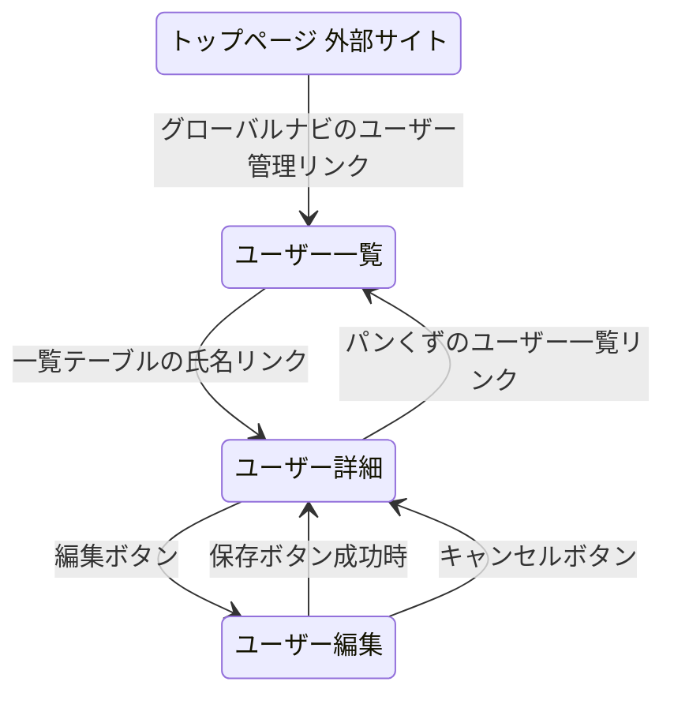
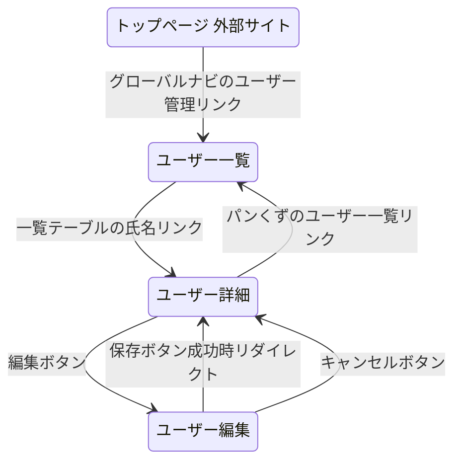

# 画面遷移図ルール

Mermaid `stateDiagram-v2` で画面間の遷移を表現する。

## 配置場所

- **`docs/design/screen-flow.md`**: プロジェクト全体の画面遷移図。init-specで自動生成する
- **要件定義書内の「## 画面遷移図」**: 個別機能の画面遷移図。draft-specでUIを持つ機能に追加する

## 記法ルール

- 各画面を `state "日本語名" as id` で定義する
- **パス・URLはダイアグラム内に書かない。** ダイアグラム直下のテーブルに分離する
- 遷移ラベルに「どの画面の何を操作すると遷移するか」を明記する
- 起点となる画面（他機能や共通レイアウトからの入口）も含め、「どこからこの機能に入るか」を明示する
- 外部サイトはラベルに「外部サイト」を付けて区別する（例: `state "GitHub 外部サイト" as ghext`）
- ブラウザバック・キャンセル・リダイレクト等の戻り遷移も記載する
- 図が大きくなる場合はカテゴリごとに分割する

### Mermaid v11 互換性ルール

mkdocs-material テーマは Mermaid v11.x を読み込む場合があり、v10.x より構文が厳格化されている。以下の文字を **stateDiagram のラベル内に直接書くと構文エラーになる**:

- `{}` 波括弧（URLのパスパラメータ `{base}` など）
- `()` 括弧（コード参照 `(file.tsx:42)` など）
- `:` コロン（パスパラメータ `/:id`、ファイル参照 `file.tsx:行番号` など）

**対策:**
- 画面パス・URLはダイアグラム直下のテーブルに記載する
- コード根拠もダイアグラム直下のテーブルに記載する
- stateDiagram の状態IDはASCII文字のみ使い、表示名は `state "日本語名" as ascii_id` で設定する

## コード根拠の記載（init-spec / spec-feature / revise-spec 使用時）

既存コードから画面遷移図を生成・更新する場合は、以下の追加ルールを適用する。

- **コードに存在するルーティング・リンクのみ記載する。推測で画面を追加しない**
- 各遷移のコード根拠をダイアグラム直下のテーブルに記載する
- 抽出対象（CLAUDE.md の `frontend` に応じてパスを解決する。tech-stack-guide.md のフロントエンド別パス対応表を参照）:
  - ルーティング定義（例: Next.js=app/pages ディレクトリ構造, Nuxt=pages/ ディレクトリ構造, Vue/React=Router定義ファイル）
  - ページ間リンク（`<Link>`、`<a>`、`<NuxtLink>`、`<RouterLink>`、`router.push()`、`navigate()` 等）
  - リダイレクト処理（認証ガード、フォーム送信後のリダイレクト等）

## Mermaid例

### コード根拠なし（draft-spec）

| 画面 | パス |
|------|------|
| ユーザー一覧 | /users |
| ユーザー詳細 | /users/:id |
| ユーザー編集 | /users/:id/edit |

### コード根拠あり（init-spec / spec-feature）

| 画面 | パス | コード根拠 |
|------|------|-----------|
| ユーザー一覧 | /users | - |
| ユーザー詳細 | /users/:id | UserTable.tsx L45 |
| ユーザー編集 | /users/:id/edit | UserDetail.tsx L92 |

| 遷移 | コード根拠 |
|------|-----------|
| トップ → ユーザー一覧 | Sidebar.tsx L28 |
| 一覧 → 詳細 | UserTable.tsx L45 |
| 詳細 → 編集 | UserDetail.tsx L92 |
| 編集 → 詳細（保存） | actions.ts L67 |
| 編集 → 詳細（キャンセル） | UserEditForm.tsx L140 |
| 詳細 → 一覧 | Breadcrumb.tsx L22 |
