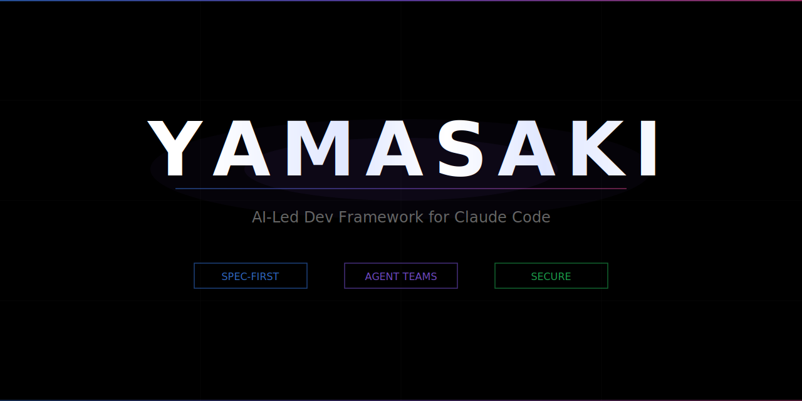

<p align="center">
  
</p>

# yamasaki

[](LICENSE)
[](https://docs.anthropic.com/en/docs/claude-code)

> A "spec-first" AI-led development template for Claude Code.

Claude Code で「設計書ファースト」の開発を自動化するテンプレート。

自然言語で話しかけるだけで、要件定義 → 基本設計 → 実装 → テスト → レビューを AI が主導して進めます。

## 特徴

- **設計書ファースト** — コードを書く前に設計書を確定。設計書とコードの乖離をゼロに
- **自然言語でOK** — 「ログイン機能を作って」と言えば AI がスキルを自動選択して実行
- **Agent Teams** — 実装は Sonnet、レビューは Opus が自動で分担
- **21のスキル同梱** — 要件定義からテストレポートまでワークフロー全体をカバー
- **セキュリティ設定済み** — 破壊的コマンドのブロック、機密ファイル保護、サンドボックス

## クイックスタート

### 前提条件

- [Claude Code](https://docs.anthropic.com/en/docs/claude-code) がインストール済み
- Git / GitHub アカウント

### 1. テンプレートからリポを作成

GitHub で「**Use this template**」→ 新しいリポを作成 → clone する。

```bash
git clone https://github.com/YOUR_ORG/myproject-docs.git
```

### 2. コードリポと並べて配置

```
workspace/
├── myproject-docs/      # このテンプレートから作った docs リポ ← ここで Claude Code を起動
└── myproject/           # コードリポ（既存 or 新規）
```

### 3. テンプレートリポURLを設定

`.claude/CLAUDE.md` の `<your-org>` を自分の GitHub org / ユーザー名に置き換える：

```
git@github.com:<your-org>/yamasaki.git
```

### 4. セットアップ

`myproject-docs/` で Claude Code を起動して話しかける：

```
このプロジェクトをセットアップして。コードは ../myproject/ にある。
```

AI が CLAUDE.md、要件概要、基本設計書、OpenAPI 仕様を自動生成します。

### 5. モデル設定（推奨）

Claude Code で `/model` を実行し、以下を設定：

- **プランモード**: Opus
- **実行モード**: Sonnet

## 使い方

セットアップ後は自然言語で話しかけるだけです。

| こう言えば... | 動くスキル | やること |
|---|---|---|
| 「このプロジェクトをセットアップして」 | init-spec | コード分析 → CLAUDE.md・設計書を自動生成 |
| 「通知機能を作りたい」 | draft-spec | 質問 → 要件定義書を生成 |
| 「認証機能の Spec を作って」 | spec-feature | 既存コードから要件定義書を逆生成 |
| 「全部の Spec を作って」 | spec-all | 全機能を一括 Spec 化 |
| 「詳細設計を作って」 | detail-design | 詳細設計書を一括生成 |
| 「REQ-AUTH-001 を実装して」 | implement-spec | 設計 → 実装 → テスト → レビュー → コミット |
| 「アップロード上限を 10MB に変えて」 | revise-spec | 影響分析 → 設計変更 → コード修正 → レビュー |
| 「このデザインに差し替えて」 | apply-design | ロジック不変で見た目だけ更新 |
| 「テストを書いて」 | gen-tests | ユニットテスト + E2E テストを追加 |
| 「本番が落ちた、緊急で直して」 | hotfix | コード先行で修正 → Spec 同期 |
| 「さっきの変更を設計書に反映して」 | update-docs | コード変更からドキュメントを追従 |
| 「テンプレートの最新を取り込んで」 | sync-template | テンプレートリポの差分を安全に取り込む |

## リポジトリ構成

```
.claude/
├── settings.json          # セキュリティ・権限設定
├── hooks/                 # コマンド実行前の安全チェック
├── rules/                 # 条件付き自動ロードルール（13個）
└── skills/                # 開発ワークフロースキル（21個）
    └── _shared/           # スキル間の共通モジュール

docs/
├── requirements/          # 要件定義（WHAT）
├── design/                # 基本設計（HOW）
├── design-detail/         # 詳細設計
├── api/                   # OpenAPI 仕様
├── templates/             # Phase 1〜4 のドキュメントテンプレート
└── tests/                 # テスト仕様・結果

ci-templates/              # GitHub Actions テンプレート
domains/                   # マルチエージェント用ドメイン分割
tasks/                     # セッション状態管理
```

## 開発フロー

```
人間: 「こういう機能がほしい」
  ↓
AI: 質問 → 要件定義書を生成 → コミット
  ↓
AI: 基本設計を更新 → コミット
  ↓
人間: 設計を確認
  ↓
AI: 実装 → テスト → レビュー → コミット
  ↓
AI: 「次は○○しますか？」
  ↓
人間: PR 作成・マージ
```

## ドキュメントプレビュー

[MkDocs Material](https://squidfunk.github.io/mkdocs-material/) で設計書をブラウザ表示できます。

```bash
# インストール（macOS）
brew install pipx
pipx install mkdocs
pipx inject mkdocs mkdocs-material mkdocs-mermaid2-plugin mkdocs-render-swagger-plugin

# プレビュー
cd myproject-docs
mkdocs serve
# → http://127.0.0.1:8000
```

## 新規 vs 既存プロジェクト

### 既存プロジェクト

1. テンプレートからリポ作成 → clone
2. 「このプロジェクトをセットアップして」→ コード分析 → 設計書を逆生成
3. 触る機能から順次 Spec 化（全機能を一度にやる必要はない）
4. 運用開始

### 新規プロジェクト

1. テンプレートからリポ作成 → clone
2. 「○○システムを作りたい」→ 全機能の要件定義 → 基本設計
3. 人間が設計を確認
4. 機能ごとに実装 → 運用開始

> **原則**: 新規プロジェクトでは全機能の要件定義と基本設計を確定してから実装に入ります。

## セキュリティ

テンプレートに以下のセキュリティ設定が同梱済みです：

- **deny ルール**: `rm -rf`, `git push --force`, `sudo` 等の破壊的コマンドをブロック
- **サンドボックス**: `.env`, 秘密鍵, クレデンシャルへのアクセスを OS レベルで制限
- **PreToolUse フック**: 本番接続、機密変数出力、SSH/SCP 等をコンテキスト判定でブロック

詳細は [`.claude/rules/security.md`](.claude/rules/security.md) を参照。

## Contributing

Issue や Pull Request は歓迎です。バグ報告・機能提案・ドキュメント改善など、お気軽にどうぞ。

## ライセンス

[MIT](LICENSE)
