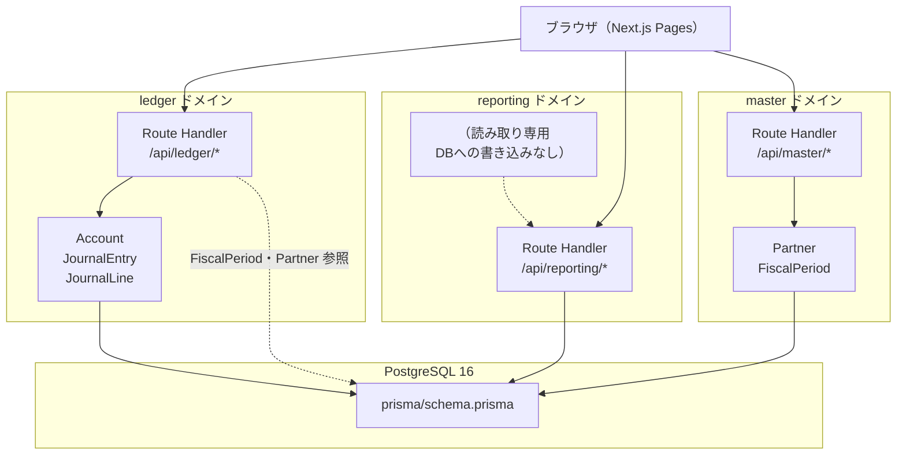

# アーキテクチャ概要

## 概要

Next.js 15 App Router によるフルスタック構成。フロントエンドとAPIエンドポイントを同一リポジトリで管理する。ドメインは ledger / reporting / master の3つに分割し、それぞれ独立した Route Handler 群を持つ。

## 技術スタック

| カテゴリ | 技術 |
|---------|------|
| フレームワーク | Next.js 15（App Router、TypeScript、src ディレクトリ） |
| スタイリング | Tailwind CSS v4 |
| グラフ | recharts |
| バリデーション | zod |
| ORM | Prisma |
| データベース | PostgreSQL 16（Docker / docker-compose、ホストポート 5433） |
| テスト | Vitest（ユニット: 集計・バリデーションロジック） |

## ドメイン構成図



## ディレクトリ構成

```
/（リポジトリルート）
├── src/
│   ├── app/
│   │   ├── layout.tsx              # ルートレイアウト（html lang=ja / ToastProvider）
│   │   ├── (app)/
│   │   │   ├── layout.tsx          # サイドバー＋メインコンテンツ枠
│   │   │   ├── page.tsx            # ダッシュボード（/）
│   │   │   ├── journal-entries/    # 仕訳一覧・入力・編集
│   │   │   ├── accounts/           # 勘定科目管理
│   │   │   ├── books/              # 仕訳帳・総勘定元帳
│   │   │   ├── reports/            # 試算表・損益計算書・貸借対照表
│   │   │   ├── partners/           # 取引先管理
│   │   │   └── settings/           # 会計期間設定
│   │   └── api/
│   │       ├── ledger/             # ledger ドメイン Route Handler
│   │       ├── reporting/          # reporting ドメイン Route Handler
│   │       └── master/             # master ドメイン Route Handler
│   ├── components/
│   │   ├── ui/                     # 共通UIコンポーネント
│   │   └── layout/                 # Sidebar / Header
│   ├── lib/
│   │   ├── prisma.ts               # PrismaClient シングルトン
│   │   ├── format.ts               # formatCurrency / formatDate
│   │   ├── api-helpers.ts          # jsonOk / jsonError / handleApiError
│   │   └── client-fetch.ts         # apiFetch
│   └── types/
│       ├── ledger.ts               # Account / JournalEntry / JournalLine 型
│       ├── master.ts               # Partner / FiscalPeriod 型
│       └── reporting.ts            # TrialBalance / IncomeStatement / BalanceSheet 型
├── prisma/
│   ├── schema.prisma               # DB スキーマ（正）
│   └── seed.ts                     # シードデータ
├── docs/                           # 設計書（本ドキュメント群）
├── docker-compose.yml              # PostgreSQL 16
└── mkdocs.yml
```

## ドメイン間依存関係

| 依存元 | 依存先 | 内容 |
|-------|-------|------|
| ledger | master | FiscalPeriod・Partner を DB 読み取りで参照 |
| reporting | ledger | Account・JournalEntry・JournalLine を DB 読み取りで参照 |
| reporting | master | FiscalPeriod を DB 読み取りで参照 |
| master | ledger | 削除時の使用中判定で JournalEntry / JournalLine を DB 読み取りで参照 |

## 画面一覧

（出典: `logs/context/superpm_plan_20260605.md`）

| パス | 画面 | ドメイン |
|------|------|---------|
| `/` | ダッシュボード | reporting |
| `/journal-entries` | 仕訳一覧 | ledger |
| `/journal-entries/new` | 仕訳入力 | ledger |
| `/journal-entries/[id]/edit` | 仕訳編集 | ledger |
| `/accounts` | 勘定科目管理 | ledger |
| `/books/journal` | 仕訳帳 | ledger |
| `/books/general-ledger` | 総勘定元帳 | ledger |
| `/reports/trial-balance` | 試算表 | reporting |
| `/reports/income-statement` | 損益計算書 | reporting |
| `/reports/balance-sheet` | 貸借対照表 | reporting |
| `/partners` | 取引先管理 | master |
| `/settings/fiscal-periods` | 会計期間設定 | master |
