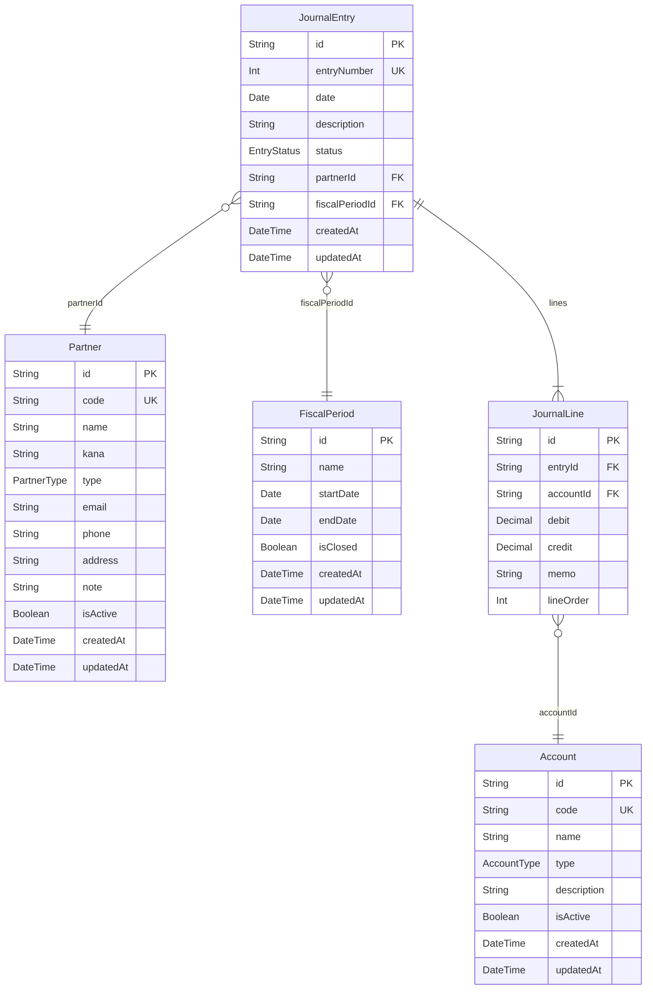

# DB設計

## 概要

PostgreSQL 16 / Prisma ORM を使用する。スキーマは `prisma/schema.prisma` が正とする（出典: `logs/context/pg_shared-foundation_20260605.md`）。

## ER図

## テーブル定義

### Account（勘定科目）

| カラム | 型 | 制約 | 説明 |
|-------|-----|------|------|
| id | String | PK, cuid() | 主キー |
| code | String | UNIQUE | 科目コード（例: "101"） |
| name | String | NOT NULL | 科目名（例: 現金） |
| type | AccountType | NOT NULL | 科目区分（ASSET/LIABILITY/EQUITY/REVENUE/EXPENSE） |
| description | String? | NULL 可 | 説明 |
| isActive | Boolean | DEFAULT true | 有効フラグ |
| createdAt | DateTime | DEFAULT now() | 作成日時 |
| updatedAt | DateTime | @updatedAt | 更新日時 |

### Partner（取引先）

| カラム | 型 | 制約 | 説明 |
|-------|-----|------|------|
| id | String | PK, cuid() | 主キー |
| code | String | UNIQUE | 取引先コード |
| name | String | NOT NULL | 取引先名 |
| kana | String? | NULL 可 | フリガナ |
| type | PartnerType | NOT NULL | 種別（CUSTOMER/VENDOR/BOTH） |
| email | String? | NULL 可 | メールアドレス |
| phone | String? | NULL 可 | 電話番号 |
| address | String? | NULL 可 | 住所 |
| note | String? | NULL 可 | 備考 |
| isActive | Boolean | DEFAULT true | 有効フラグ |
| createdAt | DateTime | DEFAULT now() | 作成日時 |
| updatedAt | DateTime | @updatedAt | 更新日時 |

### FiscalPeriod（会計期間）

| カラム | 型 | 制約 | 説明 |
|-------|-----|------|------|
| id | String | PK, cuid() | 主キー |
| name | String | NOT NULL | 期間名称（例: 2026年度） |
| startDate | DateTime | @db.Date | 開始日 |
| endDate | DateTime | @db.Date | 終了日 |
| isClosed | Boolean | DEFAULT false | 締め済みフラグ |
| createdAt | DateTime | DEFAULT now() | 作成日時 |
| updatedAt | DateTime | @updatedAt | 更新日時 |

### JournalEntry（仕訳）

| カラム | 型 | 制約 | 説明 |
|-------|-----|------|------|
| id | String | PK, cuid() | 主キー |
| entryNumber | Int | UNIQUE, autoincrement() | 仕訳番号（自動採番） |
| date | DateTime | @db.Date | 仕訳日付 |
| description | String | NOT NULL | 摘要 |
| status | EntryStatus | DEFAULT POSTED | ステータス（DRAFT/POSTED） |
| partnerId | String? | FK→Partner.id, NULL 可 | 取引先ID |
| fiscalPeriodId | String | FK→FiscalPeriod.id | 会計期間ID |
| createdAt | DateTime | DEFAULT now() | 作成日時 |
| updatedAt | DateTime | @updatedAt | 更新日時 |

**インデックス:** date, fiscalPeriodId

### JournalLine（仕訳明細）

| カラム | 型 | 制約 | 説明 |
|-------|-----|------|------|
| id | String | PK, cuid() | 主キー |
| entryId | String | FK→JournalEntry.id, onDelete:Cascade | 仕訳ID |
| accountId | String | FK→Account.id | 勘定科目ID |
| debit | Decimal | @db.Decimal(14,0), DEFAULT 0 | 借方金額（円・整数） |
| credit | Decimal | @db.Decimal(14,0), DEFAULT 0 | 貸方金額（円・整数） |
| memo | String? | NULL 可 | 摘要 |
| lineOrder | Int | DEFAULT 0 | 行順 |

**インデックス:** accountId, entryId

## 列挙型（Enum）

| 列挙型 | 値 |
|-------|-----|
| AccountType | ASSET / LIABILITY / EQUITY / REVENUE / EXPENSE |
| PartnerType | CUSTOMER / VENDOR / BOTH |
| EntryStatus | DRAFT / POSTED |

## DB所有権（ドメイン別）

| テーブル | 所有ドメイン |
|---------|------------|
| Account | ledger |
| JournalEntry | ledger |
| JournalLine | ledger |
| Partner | master |
| FiscalPeriod | master |

reporting ドメインはいずれのテーブルも読み取り専用。
