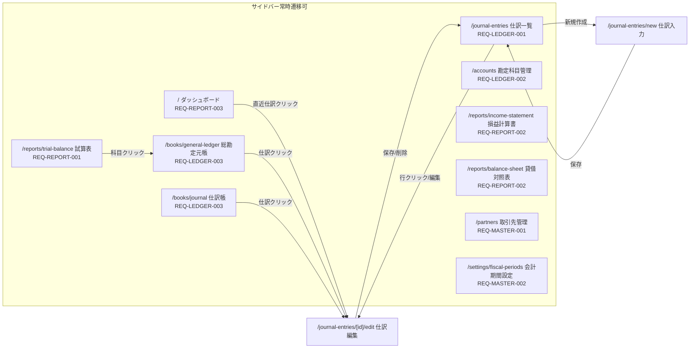

# 画面遷移図

画面遷移の Single Source of Truth。各要件定義書はここを参照する。

## 全体遷移図

## 画面一覧

| パス | 画面名 | 主な操作 | ドメイン |
|------|--------|---------|---------|
| / | ダッシュボード | KPI閲覧・グラフ・直近仕訳 | reporting |
| /journal-entries | 仕訳一覧 | 検索/フィルタ・ページング・削除 | ledger |
| /journal-entries/new | 仕訳入力 | 複式明細入力・貸借一致チェック・保存 | ledger |
| /journal-entries/[id]/edit | 仕訳編集 | 明細編集・削除 | ledger |
| /accounts | 勘定科目管理 | 一覧・モーダルでCRUD | ledger |
| /books/journal | 仕訳帳 | 期間フィルタ・閲覧 | ledger |
| /books/general-ledger | 総勘定元帳 | 科目選択・期間フィルタ・残高閲覧 | ledger |
| /reports/trial-balance | 試算表 | 期間選択・閲覧 | reporting |
| /reports/income-statement | 損益計算書 | 期間選択・閲覧 | reporting |
| /reports/balance-sheet | 貸借対照表 | 期間/基準日選択・閲覧 | reporting |
| /partners | 取引先管理 | 一覧・モーダルでCRUD | master |
| /settings/fiscal-periods | 会計期間設定 | 一覧・CRUD・締め切替 | master |

モーダル内遷移（作成/編集/削除確認）は画面遷移に含めない。
