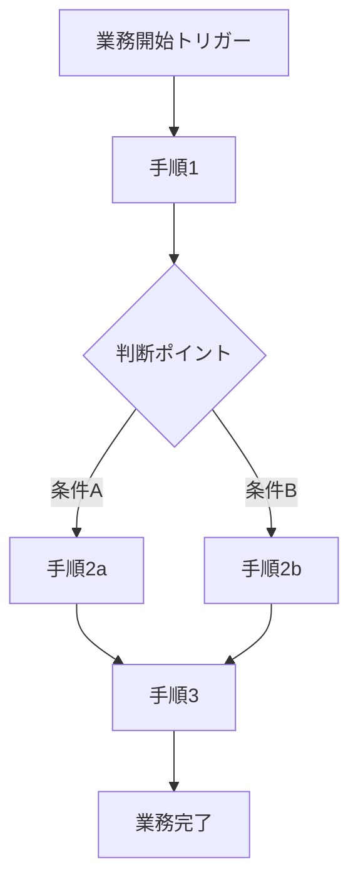
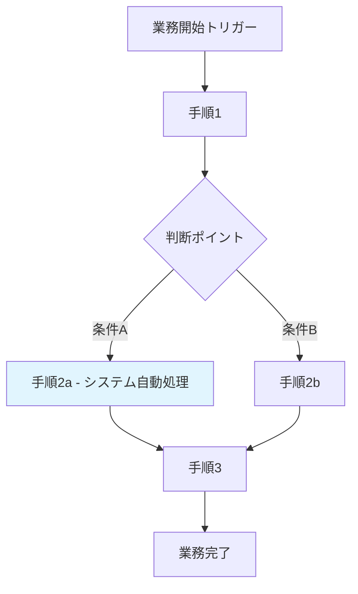

# 業務フロー図

<!-- AI: このドキュメントはシステム導入前（AS-IS）と導入後（TO-BE）の業務フローを比較し、変更点を明確にする。プロジェクト固有の業務内容に合わせて記載する

**使用判断ガイド:**
- **使う場合**: 既存の手作業・紙ベース業務をシステム化する場合、AS-IS/TO-BE比較が必要な業務改善プロジェクト、複数部署・複数担当者が関わるワークフローがある場合
- **スキップする場合**: 新規サービス（AS-ISが存在しない）でユーザー操作が要件定義書で十分に表現できている場合、API/ライブラリなどUI・業務フローを持たないプロジェクト
- **usecase.md との棲み分け**: 業務フローは「業務全体がどう流れるか」（AS-IS/TO-BE比較を含む）、ユースケースは「システムが何をするか」（システム境界の内側）。新規サービスでAS-ISがない場合はユースケースのみで十分なことが多い
-->

## 概要

<!-- AI: 業務フロー図の対象範囲と目的を1〜3行で説明する -->

## AS-IS 業務フロー（現状）

<!-- AI: システム導入前の現在の業務フローを記載する。手作業・紙ベース・既存システムでの運用を含む -->

### 全体フロー

<!-- AI: フローチャートの各ステップについて補足が必要な場合は以下に記載する -->

| ステップ | 担当者 | 作業内容 | 使用ツール | 所要時間目安 |
|---------|--------|---------|-----------|------------|
| 手順1 | 担当者名 | 作業内容の説明 | ツール名 | 時間 |
| 手順2a | 担当者名 | 作業内容の説明 | ツール名 | 時間 |
| 手順2b | 担当者名 | 作業内容の説明 | ツール名 | 時間 |
| 手順3 | 担当者名 | 作業内容の説明 | ツール名 | 時間 |

### 現状の課題

<!-- AI: 現在の業務フローにおける課題・非効率な点を箇条書きで列挙する -->

- 課題1: 説明
- 課題2: 説明

## TO-BE 業務フロー（目標）

<!-- AI: システム導入後の業務フローを記載する。自動化される部分、効率化される部分を明示する -->

### 全体フロー

<!-- AI: システム化される部分は背景色（style fill）で視覚的に区別する。上記の例では水色でシステム処理を示している -->

| ステップ | 担当者 | 作業内容 | システム化 | 所要時間目安 |
|---------|--------|---------|-----------|------------|
| 手順1 | 担当者名 | 作業内容の説明 | 手動/自動/半自動 | 時間 |
| 手順2a | システム | 自動処理の説明 | 自動 | 時間 |
| 手順2b | 担当者名 | 作業内容の説明 | 手動 | 時間 |
| 手順3 | 担当者名 | 作業内容の説明 | 半自動 | 時間 |

## 変更点一覧

<!-- AI: AS-ISとTO-BEの差分を表にまとめる。カテゴリごとに整理する -->

| カテゴリ | AS-IS（現状） | TO-BE（目標） | 期待効果 |
|---------|-------------|-------------|---------|
| データ入力 | 手動で転記 | システムから自動取得 | 入力ミス削減・工数削減 |
| 承認フロー | 紙の回覧 | システム上でワンクリック承認 | 承認リードタイム短縮 |
| レポート作成 | Excel手作業 | 自動レポート生成 | 月次作業工数削減 |

## 業務フロー一覧

<!-- AI: プロジェクト全体の業務フローを一覧で整理する。個別の詳細フローは別途サブセクションまたは別ファイルで記載してもよい -->

| フローID | 業務フロー名 | 関連アクター | トリガー | 概要 |
|---------|------------|------------|---------|------|
| BF-001 | フロー名 | アクター1, アクター2 | 開始条件 | フローの概要説明 |
| BF-002 | フロー名 | アクター名 | 開始条件 | フローの概要説明 |
| BF-003 | フロー名 | アクター名 | 開始条件 | フローの概要説明 |

## 変更履歴

| バージョン | 日付 | 変更内容 |
|-----------|------|---------|
| 1.0 | YYYY-MM-DD | 初版作成 |
