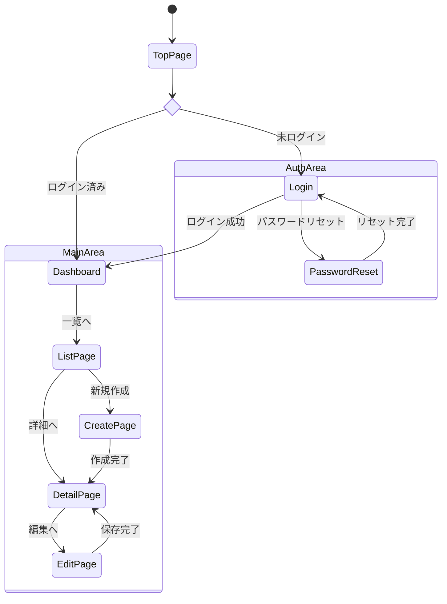

# 画面一覧・遷移図

<!-- AI: このテンプレートを使って画面一覧と遷移図を生成してください。
- docs/requirements/ の要件定義書から全画面と遷移を洗い出すこと
- Mermaid stateDiagram-v2 を使用すること
- **Mermaid v11 互換性ルール**: stateDiagram のラベル内に {} () : を直接書かないこと
  - URLパスパラメータやコード参照はダイアグラム外のテーブルに分離すること
  - 例: state label に /users/:id と書かず、テーブルで URL を別途記載する
- 認証状態による分岐（未ログイン/ログイン済み）を明確にすること

**マルチプラットフォーム時（CLAUDE.md の project_type が複数、またはプロジェクト構成に mobile リポがある場合）:**
- プラットフォームごとに画面遷移図・画面一覧・遷移一覧を pymdownx.tabbed タブで分離すること
- 共通遷移ルールはタブの外（共通セクション）に記載すること
- タブ構文: `=== "Web"` / `=== "モバイル"` （内容は4スペースインデント）
- プラットフォーム間の遷移（ディープリンク等）がある場合は「5. プラットフォーム間連携」セクションを追加すること
-->

## 1. 概要

<!-- AI: 画面遷移の全体方針を記述してください -->

---

## 2. 画面一覧

<!-- AI: 全画面を一覧表で整理する。画面IDは「SCR-[カテゴリ]-[連番]」形式で採番する -->

| 画面ID | 画面名 | URL パス | アクセス権限 | 関連REQ-ID | 備考 |
|--------|--------|---------|------------|-----------|------|
| SCR-AUTH-001 | 画面名 | /path | 未認証/認証済み | REQ-XXX-NNN | 備考 |
| SCR-AUTH-002 | 画面名 | /path | 未認証/認証済み | REQ-XXX-NNN | |
| SCR-DASH-001 | 画面名 | /path | 認証済み | REQ-XXX-NNN | |
| SCR-ADMIN-001 | 画面名 | /path | 管理者 | REQ-XXX-NNN | |

---

## 3. 画面グループ

<!-- AI: 機能領域ごとに画面をグループ化して整理する。各グループの概要と含まれる画面を記載する -->

### 認証系

<!-- AI: ログイン・サインアップ・パスワードリセット等の認証に関する画面 -->

| 画面ID | 画面名 | 概要 |
|--------|--------|------|
| SCR-AUTH-001 | 画面名 | 画面の概要説明 |
| SCR-AUTH-002 | 画面名 | 画面の概要説明 |

### メイン機能系

<!-- AI: システムの主要機能に関する画面。機能領域名はプロジェクトに合わせて変更する -->

| 画面ID | 画面名 | 概要 |
|--------|--------|------|
| SCR-DASH-001 | 画面名 | 画面の概要説明 |

### 管理機能系

<!-- AI: システム管理・運用に関する画面 -->

| 画面ID | 画面名 | 概要 |
|--------|--------|------|
| SCR-ADMIN-001 | 画面名 | 画面の概要説明 |

### 共通・その他

<!-- AI: エラーページ、404ページ、メンテナンスページ等の共通画面 -->

| 画面ID | 画面名 | 概要 |
|--------|--------|------|
| SCR-CMN-001 | 画面名 | 画面の概要説明 |

---

## 4. 画面遷移図

<!-- AI: Mermaid stateDiagram-v2 で描いてください。
- ラベルに {} () : を使わないこと（Mermaid v11 互換性）
- URLパスは遷移一覧テーブルに記載し、図ではシンプルな画面名のみ使うこと
- マルチプラットフォーム時はタブで分離（以下は例）:

=== "Web"

    ```mermaid
    stateDiagram-v2
        [*] --> TopPage
        TopPage --> Dashboard : ログイン済み
    ```

=== "モバイル"

    ```mermaid
    stateDiagram-v2
        [*] --> Splash
        Splash --> Home : ログイン済み
    ```

-->



---

## 5. 遷移一覧

<!-- AI: 全遷移パターンを記載してください。条件付き遷移は条件欄に明記すること -->

| 遷移元 | 遷移先 | トリガー | 条件 | 備考 |
|---|---|---|---|---|
| トップページ | ダッシュボード | ページアクセス | ログイン済み | - |
| トップページ | ログイン | ページアクセス | 未ログイン | - |
| ログイン | ダッシュボード | ログインボタン押下 | 認証成功 | - |

---

## 6. アクセス権限マトリクス

<!-- AI: 画面ごとのロール別アクセス権限を一覧にする。○=アクセス可、×=アクセス不可、△=条件付きアクセス -->

| 画面名 | 未認証 | 一般ユーザー | 管理者 |
|--------|--------|------------|--------|
| 画面名1 | ○ | ○ | ○ |
| 画面名2 | × | ○ | ○ |
| 画面名3 | × | △ | ○ |
| 画面名4 | × | × | ○ |

<!-- AI: △（条件付き）の画面については、以下に条件を記載する -->

**条件付きアクセスの詳細:**

- **画面名3**: 条件の説明（例: 自分が作成したデータのみ閲覧可）

---

## 7. 共通遷移ルール

<!-- AI: 全画面に適用される遷移ルールを記述してください -->

- **未認証時**: ログイン画面にリダイレクト
- **権限不足時**: 403エラー画面を表示
- **404**: 存在しないURLは404画面を表示
- **セッション切れ**: ログイン画面にリダイレクト（操作中のデータは保持しない）

## 変更履歴

| バージョン | 日付 | 変更内容 |
|-----------|------|---------|
| 1.0 | YYYY-MM-DD | 初版作成 |
