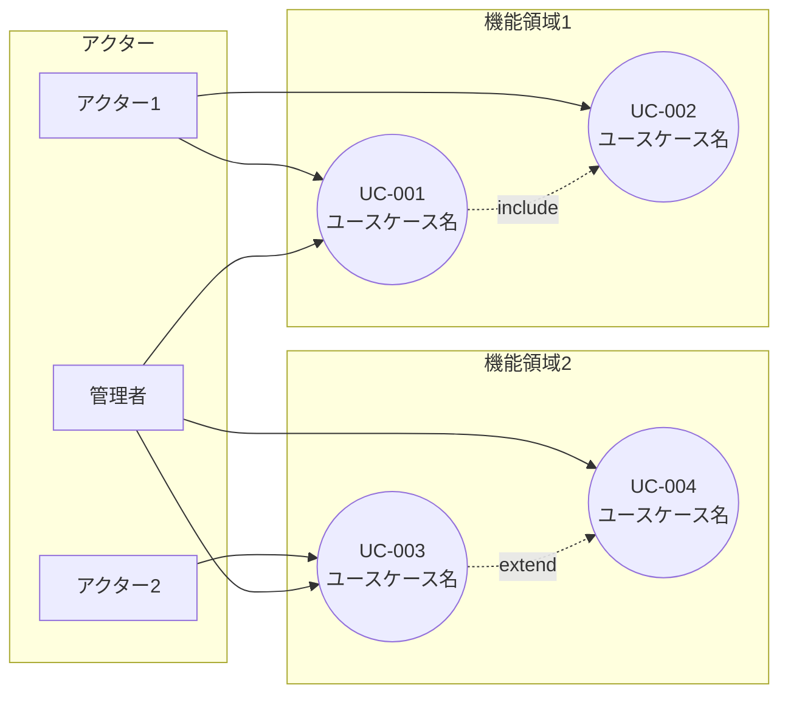

# ユースケース一覧

<!-- AI: このドキュメントはシステムのユースケースを網羅的に整理する。要件定義書（requirements-spec.md）の機能要件と対応関係を持たせること

**使用判断ガイド:**
- **使う場合**: アクターが複数いる、include/extend関係がある複雑な業務フロー、受託開発でステークホルダーとの合意形成が必要な場合
- **スキップする場合**: アクターが1種類でシンプルなCRUD中心のアプリ、要件定義書の機能要件+受入条件で十分に業務フローが表現できている場合
- **business-flow.md との棲み分け**: ユースケースは「システムが何をするか」（システム境界の内側）、業務フローは「業務全体がどう流れるか」（AS-IS/TO-BE比較を含む）。両方が必要なのは業務改善を伴う大規模プロジェクトのみ
-->

## 概要

<!-- AI: ユースケース一覧の対象範囲と目的を1〜3行で説明する -->

## アクター一覧

<!-- AI: システムに関わる全てのアクター（利用者・外部システム）を定義する -->

| アクターID | アクター名 | 種別 | 説明 |
|-----------|----------|------|------|
| ACT-01 | アクター名 | 人間/システム | アクターの役割・権限の説明 |
| ACT-02 | アクター名 | 人間/システム | アクターの役割・権限の説明 |
| ACT-03 | アクター名 | システム | 外部システムの説明 |

## ユースケース一覧

<!-- AI: 全ユースケースを一覧表で整理する。優先度は「高/中/低」で記載する -->

| UC-ID | ユースケース名 | アクター | 概要 | 優先度 | 関連REQ-ID |
|-------|-------------|--------|------|--------|-----------|
| UC-001 | ユースケース名 | アクター名 | 操作の概要説明 | 高 | REQ-XXX-NNN |
| UC-002 | ユースケース名 | アクター名 | 操作の概要説明 | 高 | REQ-XXX-NNN |
| UC-003 | ユースケース名 | アクター名 | 操作の概要説明 | 中 | REQ-XXX-NNN |
| UC-004 | ユースケース名 | アクター名 | 操作の概要説明 | 低 | REQ-XXX-NNN |

## ユースケース図

<!-- AI: Mermaid記法でユースケース図を記載する。アクターとユースケースの関係を視覚化する -->
<!-- AI: ユースケース図が大きくなる場合はカテゴリ（機能領域）ごとに分割する -->

### 全体ユースケース図

<!-- AI: include（必ず含む）/ extend（条件付きで拡張）の関係がある場合は破線矢印で示す -->

## ユースケース詳細

<!-- AI: 各ユースケースの詳細を以下のフォーマットで記述する。一覧の全UC-IDについて1つずつ作成する -->

---

### UC-001: ユースケース名

<!-- AI: ユースケース名は動詞で始める（例:「ユーザーを登録する」「注文を確定する」） -->

| 項目 | 内容 |
|------|------|
| UC-ID | UC-001 |
| ユースケース名 | ユースケース名 |
| アクター | アクター名 |
| 関連REQ-ID | REQ-XXX-NNN |
| 優先度 | 高/中/低 |

**事前条件:**

<!-- AI: このユースケースを実行するために満たすべき前提条件を記載する -->

- 事前条件1
- 事前条件2

**メインフロー:**

<!-- AI: 正常系の操作手順を番号付きで記載する。アクターの操作とシステムの応答を交互に書く -->

1. アクターが〜する
2. システムが〜を表示する
3. アクターが〜を入力する
4. システムが〜を検証する
5. システムが〜を保存する
6. システムが完了メッセージを表示する

**代替フロー:**

<!-- AI: メインフローからの分岐・例外パターンを記載する。「ステップNで〜の場合」の形式で書く -->

- **ステップ4で検証エラーの場合:**
  1. システムがエラーメッセージを表示する
  2. ステップ3に戻る

- **ステップ3でキャンセルの場合:**
  1. システムが確認ダイアログを表示する
  2. アクターが確認する
  3. ユースケースを終了する

**事後条件:**

<!-- AI: ユースケース完了後にシステムが満たすべき状態を記載する -->

- 事後条件1
- 事後条件2

---

### UC-002: ユースケース名

| 項目 | 内容 |
|------|------|
| UC-ID | UC-002 |
| ユースケース名 | ユースケース名 |
| アクター | アクター名 |
| 関連REQ-ID | REQ-XXX-NNN |
| 優先度 | 高/中/低 |

**事前条件:**

- 事前条件1

**メインフロー:**

1. アクターが〜する
2. システムが〜する

**代替フロー:**

- なし

**事後条件:**

- 事後条件1

## 変更履歴

| バージョン | 日付 | 変更内容 |
|-----------|------|---------|
| 1.0 | YYYY-MM-DD | 初版作成 |
