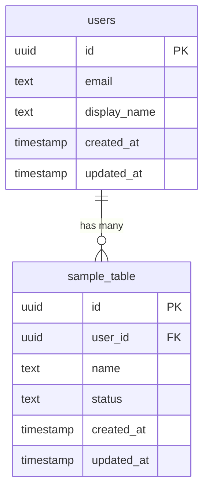

# DB論理設計書

<!-- AI: このテンプレートを使ってDB論理設計書を生成してください。
- docs/requirements/ の要件定義書から全エンティティを洗い出すこと
- 論理設計（エンティティ・リレーション・命名規則）に集中すること
- 物理設計（カラムの型・インデックス・外部キー制約・トリガー・マイグレーション）は db-schema.md に記載する
- BaaS/認証サービスを使用する場合はその認証テーブルとの関連に注意すること:
  - Supabase: auth.users との関連（CLAUDE.md の RLS ルール参照）
  - Firebase: Firebase Auth の uid との関連
  - その他: CLAUDE.md の auth 設定に従う
- id の型はプロジェクトの技術スタックに合わせる（uuid, bigint, auto_increment 等）
- DB方言は CLAUDE.md の db 設定に従うこと（postgresql / mysql / mongodb / sqlite 等）。以下の例は postgresql を前提としているが、プロジェクトのDB設定に応じて適宜読み替えること
-->

## 1. 概要

<!-- AI: DB設計の方針を記述してください -->

## 2. 命名規則

- テーブル名: スネークケース、複数形（例: `users`, `organizations`）
- カラム名: スネークケース（例: `created_at`, `display_name`）
- 外部キー: `[参照テーブル単数形]_id`（例: `user_id`, `organization_id`）
- インデックス: `idx_[テーブル名]_[カラム名]`
- ユニーク制約: `uq_[テーブル名]_[カラム名]`

## 3. ER図

<!-- AI: Mermaid erDiagram で描いてください。
- 全テーブルとリレーションを含めること
- カーディナリティを正確に記載すること
-->

## 4. テーブル一覧

<!-- AI: 全テーブルを一覧化してください。想定レコード数は運用1年後の見積もりを記載。
各テーブルの概要と役割を把握するための一覧であり、カラム詳細は db-schema.md を参照 -->

| テーブル名 | 論理名 | 説明 | 想定レコード数 | 関連Spec |
|---|---|---|---|---|
| users | ユーザー | ユーザー情報を管理する | - | REQ-XXX-001 |
| - | - | - | - | - |

## 5. テーブル概要

<!-- AI: テーブルごとに主要カラム（PK・FK・ビジネス上重要なカラム）のみ記載する。
全カラムの型・制約・デフォルト値・インデックス・外部キーは db-schema.md のテーブル詳細に記載すること -->

### 5.1 users

- **概要**: ユーザー情報を管理する
- **関連Spec**: REQ-XXX-001

| 主要カラム | 論理名 | 概要 |
|---|---|---|
| id | ID | 主キー |
| email | メールアドレス | ユニーク |
| display_name | 表示名 | - |
| created_at | 作成日時 | - |
| updated_at | 更新日時 | - |

---

<!-- AI: 上記 5.1 のセクションをテーブル数分繰り返してください -->

## 6. リレーション一覧

<!-- AI: 全テーブル間のリレーションを記載してください -->

| 親テーブル | 子テーブル | カーディナリティ | 説明 |
|---|---|---|---|
| users | - | 1:N | - |

## 7. 共通カラム仕様

<!-- AI: 全テーブルに共通するカラムの仕様を記述してください -->

| カラム名 | 概要 | 備考 |
|---|---|---|
| id | 主キー。自動生成 | 型は db-schema.md で定義 |
| created_at | レコード作成日時 | デフォルト now() |
| updated_at | レコード更新日時 | トリガーで自動更新 |

→ 物理設計の詳細（カラム型・インデックス・外部キー制約・トリガー・マイグレーション）: [テーブル定義書（物理設計）](../phase3/db-schema.md)

## 変更履歴

| バージョン | 日付 | 変更内容 |
|-----------|------|---------|
| 1.0 | YYYY-MM-DD | 初版作成 |
