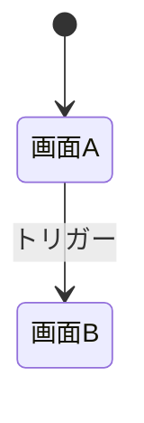

# [REQ-ID] [機能名] 画面・UI設計書

<!-- AI: このテンプレートは1機能の画面・UI設計書です。画面レイアウト・遷移・コンポーネントに集中する。
- 対応する要件定義書（docs/requirements/features/xxx.md）を必ず参照すること
- API・データモデル・ビジネスロジックは feature-logic.md に記載する（このファイルに重複させない）
- 横断型設計書（DB定義・非機能要件・外部連携）はこのファイルから参照しない（feature-logic.md 経由）
- コード分析モードではコード根拠（ファイル名:行番号）を必ず付与すること
- 生成先: docs/design/features/[feature-name].md（要件定義書のファイル名に合わせる）

デザインカンプ画像の格納ルール:
- ユーザーからデザインカンプ（Figmaスクリーンショット・画像ファイル等）が渡された場合、必ず docs/designs/[カテゴリ]/ にコピーして格納すること
- カテゴリはロール・機能単位で分ける（例: company/, student/, admin/）
- 設計書の「1. 概要」セクション末尾に「### デザインカンプ」を設け、画像を埋め込むこと
  - 形式: 
- 複数画面がある場合は画面ごとに画像を埋め込む

対になるロジック設計書:
- API・権限・データモデル・ビジネスロジック → feature-logic.md
-->

## 1. 概要

| 項目 | 値 |
|------|-----|
| 機能ID | REQ-XXX-NNN |
| 機能名 | 機能の名前 |
| 要件定義書 | [REQ-XXX-NNN](../../requirements/features/xxx.md) |
| ロジック設計書 | [feature-logic.md](./xxx-logic.md) |
| アクター | この機能を利用するユーザー種別 |
| 優先度 | 高 / 中 / 低 |

<!-- AI: 機能の目的を2〜3文で記述。要件定義書の「概要」と一致させること -->

<!-- AI: デザインカンプが渡された場合のみ以下を記載 -->
### デザインカンプ


---

## 2. 画面設計

<!-- AI: UIを持つ機能のみ。UIがない場合（バッチ処理・API専用等）は「該当なし」と記載 -->

### 2.1 画面一覧

<!-- AI: この機能スコープの画面のみ記載。システム全体の画面一覧は screen-flow.md を参照 -->

| 画面ID | 画面名 | パス | アクセスレベル | 未認証時の挙動 | 説明 |
|--------|--------|------|-------------|-------------|------|
| SCR-XXX-001 | 画面名 | /path | 公開 / 要認証 / ロール限定 | - / ログイン画面にリダイレクト | 画面の概要 |

<!-- AI: アクセスレベルは以下から選択:
- 公開: ログイン不要で誰でもアクセス可能（LP、ログイン画面、利用規約等）
- 要認証: ログイン必須。未ログインの場合はログイン画面にリダイレクトし、ログイン後に元の画面に戻す
- ロール限定: 特定ロールのみアクセス可能。権限不足の場合は403画面を表示
未認証時にリダイレクトする場合、リダイレクト先（ログインページのパス）と、
ログイン後の復帰（returnTo パラメータ等）の方式を明記する -->

### 2.2 画面レイアウト

<!-- AI: 画面ごとにASCIIアートワイヤーフレームを記載。PC/SPの差分があれば両方記載 -->

#### SCR-XXX-001: 画面名

**PC レイアウト:**
```
+----------------------------------------------------------+
| [共通ヘッダー/サイドバー]                                   |
+----------------------------------------------------------+
| ページタイトル                                              |
|                                                          |
| +------------------------------------------------------+ |
| | コンテンツ領域                                         | |
| |                                                      | |
| +------------------------------------------------------+ |
+----------------------------------------------------------+
```

**入力要素:**

| 要素名 | 種別 | 必須 | バリデーション | 初期値 | 備考 |
|--------|------|------|--------------|--------|------|
| フィールド名 | text / select / radio / checkbox / file / date | ○/- | 具体的な制約値 | - | - |

**テーブルカラム（一覧画面の場合）:**

| カラム | ソート | フィルター | 説明 |
|--------|-------|----------|------|

**操作ボタン:**

| ボタン名 | アクション | 表示条件 | API呼出先 |
|---------|-----------|---------|----------|
| ボタン名 | 動作の説明 | 常時 / 条件 | POST /api/xxx |

**ユーザー操作と処理フロー:**

<!-- AI: API呼び出しや画面遷移を伴う業務操作を定義する。
純粋なUI操作（タブ切替、アコーディオン開閉、モーダル表示等）はコンポーネント設計・ワイヤーフレームで表現するため、ここには含めない。
ただし、タブ切替時にデータを遅延取得する等、API呼び出しを伴う場合は記載する -->

| ユーザー操作 | トリガー要素 | 処理内容 | 関連API | 成功時 | 失敗時 |
|------------|------------|---------|--------|--------|--------|
| 例: 検索実行 | 検索ボタン / Enter | フィルター条件でAPI呼び出し | GET /api/resources?q= | 一覧を更新 | エラーバナー |
| 例: 新規作成 | 保存ボタン | バリデーション→API呼び出し | POST /api/resources | トースト + 一覧に遷移 | インラインエラー表示 |
| 例: 削除 | 削除ボタン | 確認モーダル→API呼び出し | DELETE /api/resources/{id} | トースト + 一覧から除去 | エラートースト |

<!-- AI: 処理内容の記載ルール:
- 確認画面を挟む場合は「確認画面→API呼び出し」と明記する
- 確認画面が不要な場合は「バリデーション→API呼び出し」のように確認画面を省略する
- 確認モーダル（画面内ダイアログ）と確認画面（別ページ遷移）を区別する -->

**データバインディング:**

<!-- AI: 画面上の各要素が、どのAPIエンドポイントのどのフィールドと対応するかを定義する。
- 表示要素: どのAPIレスポンスのどのフィールドを表示するか
- 入力要素: どのAPIリクエストのどのフィールドに送信するか
- セレクトボックス等の選択肢: 選択肢をどのAPIから取得するか
- フィールド名は openapi.yaml の schemas 定義に合わせること -->

| 画面要素 | 表示/入力 | APIエンドポイント | フィールドパス | 変換・備考 |
|---------|----------|----------------|-------------|----------|
| 例: ユーザー名 | 表示 | GET /api/users/{id} | response.user.display_name | - |
| 例: メールアドレス | 入力→送信 | PUT /api/users/{id} | requestBody.email | - |
| 例: ステータスバッジ | 表示 | GET /api/users/{id} | response.user.status | "active"→緑, "inactive"→灰 |
| 例: 部署セレクト | 選択肢取得 | GET /api/departments | response.departments[].name | id を value に設定 |

**画面状態:**

<!-- AI: shared-components.md で定義した画面状態パターンのうち、この画面で使用するものを指定する -->

| 状態 | 使用パターン | 補足 |
|------|------------|------|
| ローディング | 画面全体スケルトン / 領域スケルトン | - |
| エラー | エラーバナー + リトライ | - |
| 空状態 | 初期空状態 / 検索結果なし | - |
| フォーム送信後 | トースト通知 → 一覧に遷移 | - |

**レスポンシブ対応:**

- **PC**: -
- **SP**: -

### 2.3 画面遷移

<!-- AI: この機能内の画面遷移をMermaid stateDiagram-v2で記載。
Mermaid v11互換: ラベル内に {} () : を直接書かないこと -->



| 遷移 | トリガー | 条件 | 受け渡しパラメータ | 受け渡し方法 | コード根拠 |
|------|---------|------|------------------|------------|-----------|
| 例: 一覧→詳細 | 行クリック | - | userId | URLパス /users/{userId} | - |
| 例: 詳細→編集 | 編集ボタン | 権限あり | userId, formData | state（Router state） | - |
| 例: 検索→一覧 | 検索実行 | - | keyword, category | クエリパラメータ ?q=&cat= | - |

<!-- AI: 受け渡し方法は以下から選択:
- URLパス: /resources/{id} のような動的セグメント
- クエリパラメータ: ?key=value 形式
- state（Router state）: React Router / Next.js の state、Vue Router の params
- localStorage / sessionStorage: 一時的な大きいデータ
- 遷移先で再取得: パラメータを渡さず、遷移先画面でAPIから直接取得する場合 -->

---

## 3. 共通コンポーネント

<!-- AI: この機能で利用する共通コンポーネント、および新たに共通化すべきものを記載する。
- docs/design/shared-components.md を必ず参照し、既存の共通コンポーネントで使えるものを洗い出すこと
- 新たに共通化すべきものがあれば「新規提案」に記載し、実装時に shared-components.md へ反映する
- shared-components.md が存在しない場合は「初回実装時に作成予定」と記載 -->

### 3.1 利用する既存共通コンポーネント

| コンポーネント名 | 用途（この機能での使い方） | カスタマイズ |
|----------------|------------------------|------------|
| 例: Button | 送信ボタン、キャンセルボタン | variant="primary" |
| 例: useAuth | ログイン状態の確認 | なし |

### 3.2 新規共通化の提案

<!-- AI: この機能の実装で新たに共通化すべきと判断したものを記載。
判断基準: 他の機能でも使われる（または使われる見込みがある）処理・UIパターン -->

| 提案コンポーネント名 | 種別 | 理由（どの機能と共通か） | 想定ファイルパス |
|-------------------|------|----------------------|---------------|

---

## 4. ページ固有コンポーネント設計

<!-- AI: このページ/機能内でのみ使用するコンポーネントの分割計画を記載する。
- 共通コンポーネント（セクション3）に該当しない、ページ内のUI分割を定義する
- shared-components.md の「コンポーネント粒度の判断基準」に従って粒度を決定する
- UIを持たない機能（バッチ処理・API専用等）は「該当なし」と記載 -->

### 4.1 コンポーネント構成図

<!-- AI: このページのコンポーネントツリーをテキストで表現する。
共通コンポーネントは [共通] マーカーを付ける -->

```
app/xxx/page.tsx
├── XxxHeader（ページ固有ヘッダー）
├── XxxFilterPanel（フィルター操作）
│   ├── [共通] SearchBar
│   └── [共通] DateRangePicker
├── XxxContentList（メインコンテンツ）
│   ├── XxxContentCard（カード表示）
│   │   └── [共通] Badge
│   └── [共通] Pagination
└── XxxDetailModal（詳細モーダル）
    └── [共通] Button
```

### 4.2 ページ固有コンポーネント一覧

| コンポーネント名 | 粒度 | 責務 | 主要Props | 配置先 |
|----------------|------|------|----------|--------|
| 例: XxxFilterPanel | L3 機能ブロック | フィルター条件の入力・適用 | filters, onApply | app/xxx/_components/ |
| 例: XxxContentCard | L2 複合部品 | コンテンツ1件の表示 | item, onSelect | app/xxx/_components/ |

<!-- AI: 粒度は shared-components.md のレベル定義（L1〜L4）を使用する。
後から2箇所以上で使うことになった場合は、共通コンポーネントに昇格させる -->

---

## 5. コード根拠

<!-- AI: コード分析モードでは必須。この機能の実装ファイル一覧 -->

| 項目 | ファイル | 説明 |
|------|---------|------|
| ページコンポーネント | app/xxx/page.tsx | 画面 |
| ページ固有コンポーネント | app/xxx/_components/*.tsx | ページ内UI分割（セクション4参照） |
| 共通コンポーネント | components/xxx.tsx | UI部品（shared-components.md に登録済み） |

→ API・ロジック関連のコード根拠は [ロジック設計書](./xxx-logic.md) を参照

---

## 6. フロントエンド状態管理（該当する場合）

<!-- AI: フロントエンドを含む機能で、ページ内の状態管理が複雑な場合のみ記載。
単純なフォーム送信のみの画面や、UIを持たない機能はセクションごと省略 -->

| 状態名 | スコープ | 管理方法 | 永続化 | 初期値 | 更新トリガー |
|--------|---------|---------|--------|--------|------------|
| 例: filterParams | URL | URLSearchParams | URL | {} | フィルター操作時 |
| 例: formDraft | ローカル | React Hook Form | なし | {} | 入力変更時 |
| 例: isModalOpen | ローカル | useState | なし | false | ボタンクリック時 |

<!-- AI: スコープの選択基準:
- グローバル: アプリ全体で共有（認証情報、テーマ等）→ Context / Store
- サーバーデータ: APIから取得するデータ → SWR / React Query / fetch
- URL: ブラウザの戻るボタンで復元したい状態 → URLSearchParams
- ローカル: このコンポーネント内だけ → useState / useReducer -->
