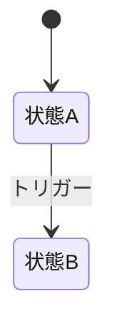

# [REQ-ID] [機能名] ロジック設計書

<!-- AI: このテンプレートは1機能のロジック・データ設計書です。API・データモデル・ビジネスロジックに集中する。
- 対応する要件定義書（docs/requirements/features/xxx.md）を必ず参照すること
- 対応する画面・UI設計は feature-design.md を参照すること
- API共通仕様・DB定義・非機能要件・外部連携は横断型設計書を参照する（このファイルに重複させない）
- コード分析モードではコード根拠（ファイル名:行番号）を必ず付与すること
- 生成先: docs/design/features/[feature-name]-logic.md（feature-design.md と対で生成する）

参照先の横断型設計書:
- API仕様（リクエスト/レスポンス・バリデーション）→ ../../api/openapi.yaml（APIの Single Source of Truth）
- DB詳細スキーマ（全カラム・型・制約）→ ../db-schema.md
- セキュリティ設計（認証・認可・OWASP対策）→ ../security-design.md
- 外部連携仕様（API連携・Webhook等）→ ../external-integration.md
- エラーコード定義 → ../error-codes.md
- 非機能要件（性能・可用性・スケーラビリティ）→ ../non-functional.md
-->

## 1. 概要

| 項目 | 値 |
|------|-----|
| 機能ID | REQ-XXX-NNN |
| 機能名 | 機能の名前 |
| 要件定義書 | [REQ-XXX-NNN](../../requirements/features/xxx.md) |
| 画面・UI設計 | [feature-design.md](./xxx.md) |

---

## 2. 使用APIエンドポイント

<!-- AI: この機能で使用するAPIエンドポイントのパス一覧のみ記載する。
リクエスト/レスポンス・バリデーションの詳細定義は openapi.yaml（Single Source of Truth）を参照すること。
ここにはパラメータやレスポンス構造を重複して書かない -->

| メソッド | パス | 説明 |
|----------|------|------|
| GET | /api/xxx | リソース取得 |
| POST | /api/xxx | リソース作成 |

→ 詳細: [OpenAPI仕様](../../api/openapi.yaml)

### 2.1 画面初期表示のAPI呼び出し順序

<!-- AI: 画面表示時に複数APIを呼ぶ場合、呼び出し順序と依存関係を定義する。
1画面1APIの場合はこのセクションを省略してよい -->

| # | APIエンドポイント | 依存 | 並列可 | 失敗時の挙動 | 必須/任意 |
|---|----------------|------|--------|------------|---------|
| 1 | GET /api/auth/me | なし | - | ログイン画面にリダイレクト | 必須 |
| 2 | GET /api/master/categories | なし | 1と並列可 | キャッシュから取得 / エラー表示 | 任意（なくても画面表示可） |
| 3 | GET /api/resources | 1の認証情報が必要 | 2と並列可 | エラー表示（リトライボタン付き） | 必須 |

<!-- AI: 複数APIの部分失敗時の挙動:
- 「必須」APIが失敗 → 画面全体をエラー表示（リトライボタン付き）
- 「任意」APIが失敗 → 失敗した領域のみエラー表示し、他の部分は正常表示
- 全APIが失敗した場合もエラーページではなくエラーバナー + リトライを基本とする -->

### 2.2 権限チェック

<!-- AI: この機能の各操作に必要な権限を定義する。
横断的な認証・認可の仕組みは security-design.md を参照。ここでは機能固有の権限のみ記載 -->

| 操作 | 必要ロール | 追加条件 | 権限なし時の挙動 |
|------|----------|---------|----------------|
| 例: 一覧表示 | 全認証ユーザー | - | 403画面表示 |
| 例: 編集 | admin, owner | 自分が作成したリソースのみ | ボタン非表示 |
| 例: 削除 | admin | - | ボタン非表示 |

<!-- AI: 権限なし時のUI出し分け方法は以下から選択:
- 非表示: 要素自体をDOMから削除（権限のないユーザーには存在を知らせない）
- disabled: 要素は表示するが操作不可（ツールチップで「権限が必要です」と表示）
- 403画面表示: ページレベルのアクセス拒否
- リダイレクト: 権限のあるページ（トップ等）に自動遷移
基準: 一般的には「非表示」をデフォルトとし、操作できないことをユーザーに伝える必要がある場合のみ「disabled」を使う -->

---

## 3. 使用データモデル

<!-- AI: この機能に関連するテーブルと操作の概要のみ記載。
カラム定義の詳細は design/db-schema.md を参照すること -->

| テーブル名 | この機能での用途 | 主な操作 |
|-----------|----------------|---------|
| table_name | 用途の説明 | SELECT / INSERT / UPDATE / DELETE |

**削除時の関連データの扱い（該当する場合）:**

<!-- AI: この機能でDELETE操作がある場合、関連テーブルのデータをどう扱うか定義する。
DELETE操作がない機能はこのテーブルを省略してよい -->

| 削除対象 | 関連テーブル | 関連データの扱い | 備考 |
|---------|------------|----------------|------|
| 例: users | posts | 論理削除を連鎖（postsも deleted_at をセット） | ユーザー復元時にpostsも復元 |
| 例: users | comments | 紐付け解除（user_id を null にする） | 匿名コメントとして残す |
| 例: users | sessions | 物理削除（即座に全セッション削除） | セキュリティ上即座に無効化 |

→ 詳細: [DB詳細スキーマ](../db-schema.md)

---

## 4. ビジネスロジック

<!-- AI: この機能固有のビジネスロジックを記載。
複数機能にまたがるロジックは design/business-logic.md への参照にする -->

### 4.1 処理ステップ

<!-- AI: 処理ステップ表が実装の正（Single Source of Truth）。
Mermaid sequenceDiagram は視覚的補助として任意で追加してよいが、矛盾した場合はこの表が優先する -->

| # | アクター | アクション | 説明 | エラー処理 |
|---|---------|----------|------|-----------|
| 1 | ユーザー | 操作 | 操作の詳細 | - |
| 2 | API | バリデーション | 入力検証 | 400エラー返却 |
| 3 | API | DB操作 | データ読み書き | 500エラー返却 |

### 4.3 状態遷移（該当する場合）

<!-- AI: ステータスカラムを持つエンティティがある場合のみ。
ない場合はセクションごと省略 -->

**遷移×権限マトリクス:**

| 遷移 | ロールA | ロールB | 条件 |
|------|--------|--------|------|

**副作用テーブル:**

| 遷移 | 副作用 | 非同期 |
|------|--------|--------|

### 4.4 バリデーションルール

<!-- AI: この機能固有のバリデーションのみ記載。
共通バリデーション（認証・CSRF等）は security-design.md を参照 -->

| フィールド | ルール | サーバー側 | クライアント側 | 実行タイミング | エラーメッセージ |
|-----------|--------|----------|-------------|--------------|----------------|

<!-- AI: 実行タイミングは以下から選択:
- onChange: 入力値が変わるたびにリアルタイム検証
- onBlur: フォーカスが外れた時に検証
- onSubmit: フォーム送信時にまとめて検証
- サーバー側のみ: クライアントでは検証せずAPIレスポンスで判定（ユニーク制約等） -->

### 4.5 一覧表示仕様（一覧画面の場合）

<!-- AI: 一覧表示を持つ機能のみ。一覧がない場合はセクションごと省略 -->

**ページネーション:**

| 項目 | 値 |
|------|-----|
| 方式 | オフセット / カーソル |
| UI | ページ送りボタン / 無限スクロール |
| 1ページあたり件数 | 20（デフォルト） |
| URL管理 | クエリパラメータ ?page=2 / state管理 |

**ソート:**

| 項目 | 値 |
|------|-----|
| 実装方式 | APIソート（サーバー側で ORDER BY）/ フロントソート（取得済みデータをメモリ内でソート） |
| デフォルトソート | 作成日時降順 |
| 複数列ソート | 対応する / しない |
| ソート状態のURL管理 | クエリパラメータ ?sort=name&order=asc / state管理 |

<!-- AI: 実装方式の選択基準:
- APIソート: ページネーションと併用する場合は必須（全件取得しないため）
- フロントソート: 全件をフロントに持っている場合のみ可能（マスタデータ等の少量データ） -->

**フィルター:**

| 項目 | 値 |
|------|-----|
| フィルター条件 | テキスト検索 / ステータス / 日付範囲 / カテゴリ 等 |
| 実装方式 | APIフィルター（クエリパラメータで送信）/ フロントフィルター |
| URL管理 | クエリパラメータ ?status=active&q=keyword / state管理 |
| フィルターリセット | リセットボタンで全条件クリア |
| ブラウザ戻るボタン | フィルター条件がURLに含まれるため、前の検索条件に戻る / state管理のためリセットされる |

### 4.6 ファイルアップロード（該当する場合）

<!-- AI: ファイルアップロードを含む機能のみ。該当しない場合はセクションごと省略 -->

| 項目 | 値 |
|------|-----|
| 最大ファイルサイズ | 10MB |
| 許可拡張子 | jpg, png, pdf |
| 同時アップロード数 | 5 |
| 保存先 | S3 / ローカルストレージ |
| アクセス制御 | 認証必須 / 公開 |
| プレビュー | あり / なし |
| 削除 | 許可 / 管理者のみ |

### 4.7 代替フロー・例外フロー

| # | 条件 | フロー | 結果 |
|---|------|--------|------|
| A1 | 異常条件 | 代替処理 | ユーザーへの通知 |

### 4.8 トランザクション境界（該当する場合）

<!-- AI: 複数テーブルを更新する処理や、同時操作の制御が必要な場合のみ記載。
該当しない場合はセクションごと省略 -->

| # | 対象ステップ | トランザクション範囲 | ロック方式 | 競合時の挙動 |
|---|------------|-------------------|----------|-------------|
| 1 | ステップN〜M | BEGIN〜COMMIT | 楽観的ロック（updated_at 比較）/ 悲観的ロック（SELECT FOR UPDATE） | 409 Conflict を返却 / リトライ |

### 4.9 非同期処理フロー（該当する場合）

<!-- AI: キュー、バックグラウンドジョブ、WebSocket、Pub/Sub等がある場合のみ記載。
該当しない場合はセクションごと省略 -->

| # | トリガー | 処理方式 | 処理内容 | リトライ方針 | 失敗時の挙動 |
|---|---------|---------|---------|-------------|------------|
