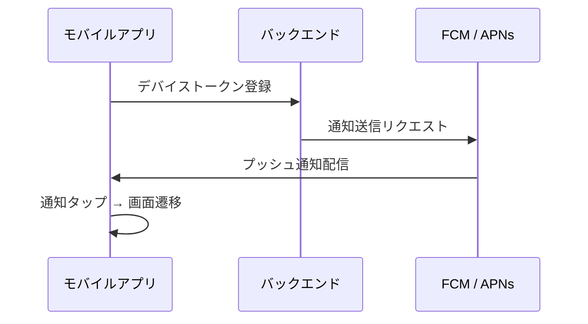
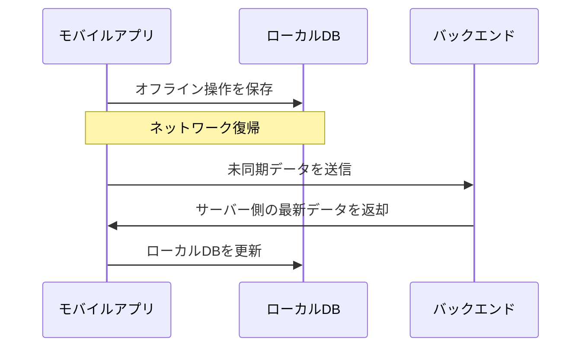

# プラットフォーム間連携設計

<!-- AI: このテンプレートはオプションです。以下の条件に該当する場合のみ生成してください:
- CLAUDE.md のプロジェクト構成に複数プラットフォーム（Web + Mobile 等）のリポがある
- かつ、プラットフォーム間で以下のいずれかの連携がある:
  - ディープリンク（Web URL → モバイルアプリ遷移）
  - プッシュ通知（バックエンド → モバイル）
  - 認証トークンの共有・引き継ぎ
  - オフライン同期
  - QRコード等によるクロスデバイス連携

上記に該当しない場合（モバイルが独立して API を叩くだけ等）はこのテンプレートを生成しないこと。
-->

## 1. 概要

<!-- AI: どのプラットフォーム間で、どのような連携があるか全体像を記述してください -->

| 連携種別 | プラットフォーム | 方向 | 概要 |
|---|---|---|---|
| ディープリンク | Web → Mobile | 単方向 | - |
| プッシュ通知 | Backend → Mobile | 単方向 | - |
| 認証共有 | Web ↔ Mobile | 双方向 | - |

## 2. ディープリンク設計

<!-- AI: Web URL とモバイルアプリ画面のマッピングを定義してください。
- Universal Links (iOS) / App Links (Android) の対応を記載すること
- アプリ未インストール時のフォールバック（Web遷移 or ストア誘導）を明記すること
-->

### 2.1 URLマッピング

| Web URL パターン | アプリ画面 | パラメータ | フォールバック |
|---|---|---|---|
| `/items/:id` | 商品詳細画面 | item_id | Web版を表示 |
| `/invite/:code` | 招待受理画面 | invite_code | ストアに誘導 |

### 2.2 設定ファイル

<!-- AI: 必要な設定ファイルを記載してください -->

| プラットフォーム | 設定ファイル | 設定内容 |
|---|---|---|
| iOS | `apple-app-site-association` | Universal Links ドメイン定義 |
| Android | `assetlinks.json` | App Links 検証用 |
| Web（バックエンド） | `.well-known/` 配下 | 上記ファイルの配信 |

## 3. プッシュ通知設計

<!-- AI: プッシュ通知のフローを記述してください。
- デバイストークンの管理方法を明記すること
- 通知種別ごとのペイロード構造を定義すること
-->

### 3.1 通知フロー

### 3.2 通知種別

| 通知種別 | トリガー | 遷移先画面 | ペイロード |
|---|---|---|---|
| - | - | - | - |

### 3.3 デバイストークン管理

| 項目 | 方針 |
|---|---|
| 保存先 | - |
| 更新タイミング | アプリ起動時 + トークンリフレッシュ時 |
| 複数デバイス対応 | ユーザーあたり最大N台 |
| トークン失効時 | FCM/APNs エラーで自動削除 |

## 4. 認証トークン共有

<!-- AI: Web とモバイルでの認証方式の違いと、セッション引き継ぎの方法を記述してください。
- トークン保存場所（Web: httpOnly Cookie / Mobile: Keychain / Keystore）を明記すること
- リフレッシュトークンの運用方針を統一すること
-->

### 4.1 プラットフォーム別認証方式

| 項目 | Web | モバイル |
|---|---|---|
| トークン種別 | - | - |
| 保存場所 | httpOnly Cookie | Keychain (iOS) / Keystore (Android) |
| リフレッシュ | - | - |
| セッション期限 | - | - |

### 4.2 クロスプラットフォーム引き継ぎ

<!-- AI: Web → モバイル、またはモバイル → Web のセッション引き継ぎが必要な場合に記載 -->

| シナリオ | 方法 | 備考 |
|---|---|---|
| Web → アプリ（ディープリンク経由） | - | - |
| アプリ → Web（ブラウザ起動時） | - | - |

## 5. オフライン対応・データ同期

<!-- AI: モバイルアプリでオフライン操作をサポートする場合のみ記載。不要な場合はセクションごと削除 -->

### 5.1 同期方針

| 項目 | 方針 |
|---|---|
| 同期方式 | - |
| コンフリクト解決 | Last Write Wins / サーバー優先 / ユーザー選択 |
| 同期対象データ | - |
| オフライン時の操作制限 | - |

### 5.2 同期フロー

## 6. その他のクロスデバイス連携

<!-- AI: QRコード連携、WebSocket によるリアルタイム同期等、上記に当てはまらない連携がある場合に記載。
不要な場合はセクションごと削除 -->

| 連携種別 | 概要 | 技術 |
|---|---|---|
| - | - | - |
