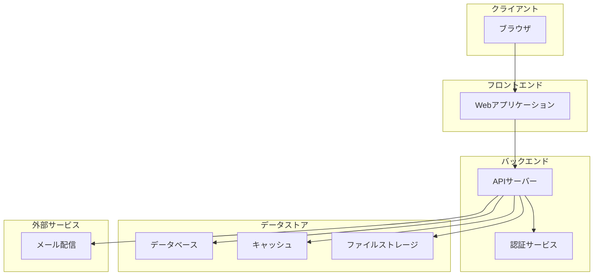

# システム構成図

<!-- AI: このテンプレートを使ってシステム構成図を生成してください。
- docs/requirements/ の要件定義書を参照し、必要なコンポーネントを洗い出すこと
- 技術スタックは CLAUDE.md や overview.md の記載と一致させること
- 環境ごとの差異（dev/staging/prod）を明確にすること
- 通信方式は全てのコンポーネント間接続を網羅すること

**マルチプラットフォーム時（CLAUDE.md の project_type が複数、またはプロジェクト構成に mobile リポがある場合）:**
- システム構成図（セクション2）は全プラットフォームを1つの Mermaid 図に含めること（タブ分離しない）
  - Client サブグラフ内に Browser と MobileApp を並列配置する
- コンポーネント一覧（セクション3）にモバイルアプリ層のコンポーネントを追加すること
- 通信方式（セクション4）にモバイル固有の通信（プッシュ通知、ディープリンク等）を追加すること
- 技術スタック（セクション6）にモバイルのフレームワーク・ツールを追加すること
-->

## 1. システム概要

<!-- AI: システムの目的・全体像を2〜3文で簡潔に記述してください -->

## 2. システム構成図

<!-- AI: Mermaid flowchart で全体構成を描いてください。
- ユーザー、フロントエンド、バックエンド、DB、外部サービスを含めること
- サブグラフで論理的なグループ分けをすること
-->

<!-- AI: マルチプラットフォーム時は Client サブグラフに MobileApp を追加する:
    subgraph Client["クライアント"]
        Browser["ブラウザ"]
        MobileApp["モバイルアプリ"]
    end
-->

## 3. コンポーネント一覧

<!-- AI: 全コンポーネントを漏れなく記載してください -->

| コンポーネント名 | 種別 | 技術 | 説明 |
|---|---|---|---|
| Webアプリケーション | フロントエンド | - | - |
| APIサーバー | バックエンド | - | - |
| データベース | データストア | - | - |
| キャッシュ | データストア | - | - |
| ファイルストレージ | データストア | - | - |

## 4. 通信方式

<!-- AI: コンポーネント間の全通信を記載してください。プロトコル・認証方式も明記すること -->

| 通信元 | 通信先 | プロトコル | 認証方式 | 説明 |
|---|---|---|---|---|
| ブラウザ | Webアプリケーション | HTTPS | - | - |
| Webアプリケーション | APIサーバー | HTTPS | Bearer Token | - |
| APIサーバー | データベース | TCP | 接続文字列 | - |

## 5. インフラ構成

<!-- AI: 環境ごとの構成差異を明確にしてください -->

### 5.1 開発環境（dev）

| リソース | 構成 | 備考 |
|---|---|---|
| サーバー | - | - |
| データベース | - | - |
| ストレージ | - | - |

### 5.2 ステージング環境（staging）

| リソース | 構成 | 備考 |
|---|---|---|
| サーバー | - | - |
| データベース | - | - |
| ストレージ | - | - |

### 5.3 本番環境（prod）

| リソース | 構成 | 備考 |
|---|---|---|
| サーバー | - | - |
| データベース | - | - |
| ストレージ | - | - |

## 6. 技術スタック

<!-- AI: CLAUDE.md や overview.md の技術スタック記載と一致させること -->

| カテゴリ | 技術 | バージョン | 備考 |
|---|---|---|---|
| フロントエンド | - | - | - |
| バックエンド | - | - | - |
| データベース | - | - | - |
| インフラ | - | - | - |
| CI/CD | - | - | - |
| 監視 | - | - | - |
