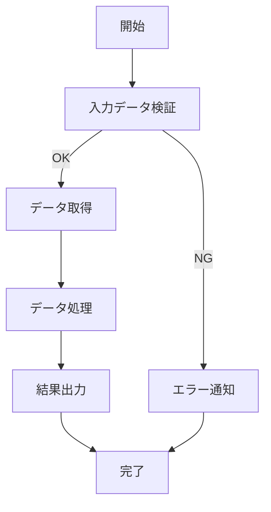
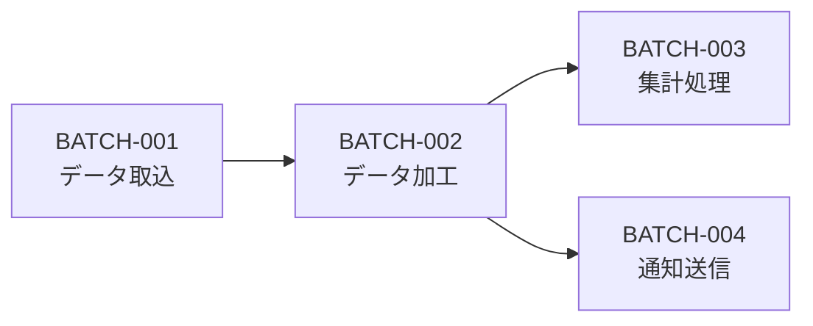

# バッチ設計書

<!-- AI: このテンプレートを使ってバッチ設計書を生成してください。
- docs/requirements/ の要件定義書を参照し、全バッチ処理を網羅すること
- 各バッチのスケジュール・依存関係・エラーハンドリングを漏れなく定義すること
- バッチ間の実行順序と依存関係を明確にすること
- 性能要件はタイムアウト・最大処理件数・同時実行数を具体的に定義すること
-->

## 1. 概要

<!-- AI: バッチ処理の全体像・目的を2〜3文で記述してください -->

## 2. バッチ一覧

<!-- AI: 全バッチを一覧にしてください。要件定義書のバッチ処理関連要件を全てカバーすること -->

| # | バッチID | バッチ名 | スケジュール | トリガー | 優先度 | 関連Spec |
|---|---------|---------|------------|---------|--------|---------|
| 1 | BATCH-001 | バッチ名 | 0 2 * * * | スケジュール | 高 | REQ-XXX-NNN |
| 2 | BATCH-002 | バッチ名 | イベント駆動 | イベント名 | 中 | REQ-XXX-NNN |

## 3. バッチ詳細

<!-- AI: バッチごとにこのセクションを繰り返してください。全バッチ分を漏れなく記載すること -->

### 3.1 BATCH-001: バッチ名

| 項目 | 値 |
|------|-----|
| バッチID | BATCH-001 |
| バッチ名 | バッチ名 |
| 概要 | バッチの概要 |
| 関連Spec | REQ-XXX-NNN |

#### 実行スケジュール

| 項目 | 値 |
|------|-----|
| cron式 | 0 2 * * * |
| 説明 | 毎日午前2時に実行 |
| タイムゾーン | Asia/Tokyo <!-- AI: タイムゾーンは CLAUDE.md の技術制約に応じて設定 --> |
| 実行環境 | 実行サーバー/コンテナ |

#### 入力/出力

| # | 項目 | 入出力 | ソース/出力先 | フォーマット | 説明 |
|---|------|--------|-------------|------------|------|
| 1 | 入力データ | 入力 | テーブル名 / ファイルパス | DB / CSV / JSON | 説明 |
| 2 | 出力データ | 出力 | テーブル名 / ファイルパス | DB / CSV / JSON | 説明 |

#### 処理フロー

<!-- AI: Mermaid flowchart でバッチの処理フローを描いてください -->



#### エラーハンドリング

| # | エラー種別 | 検出方法 | リトライ | 通知先 | フォールバック |
|---|-----------|---------|---------|--------|-------------|
| 1 | 入力データ不正 | バリデーション | なし | 管理者メール | スキップして続行 |
| 2 | DB接続エラー | 例外捕捉 | 最大3回（指数バックオフ） | 管理者メール | 処理中断 |
| 3 | タイムアウト | タイマー | なし | 管理者メール | 処理中断・次回再実行 |

#### 性能要件

| 項目 | 値 |
|------|-----|
| タイムアウト | 30分 |
| 最大処理件数 | 100,000件 |
| バッチサイズ | 1,000件 |
| 同時実行数 | 1（排他制御あり） |
| 想定処理時間 | 10分以内 |

#### 依存関係

<!-- AI: 他バッチや外部システムへの依存を記述してください -->

| # | 依存先 | 種別 | 説明 |
|---|--------|------|------|
| 1 | BATCH-000 | 先行バッチ | 完了後に実行 |
| 2 | 外部API | 外部システム | データ取得元 |

---

<!-- AI: ここまでのバッチ詳細セクション（3.1）を全バッチ分繰り返してください -->

## 4. バッチ実行順序

<!-- AI: バッチ間の依存関係と実行順序を Mermaid flowchart で描いてください -->



<!-- AI: 時系列での実行スケジュールも記載してください -->

| 時刻 | バッチID | バッチ名 | 依存先 |
|------|---------|---------|--------|
| 02:00 | BATCH-001 | バッチ名 | なし |
| 02:30 | BATCH-002 | バッチ名 | BATCH-001 |

## 5. 運用手順

### 5.1 手動実行

<!-- AI: 手動でバッチを実行する手順を記述してください -->

```bash
# 実行コマンド例
# npm run batch:BATCH-001 -- --dry-run  # ドライラン
# npm run batch:BATCH-001               # 本番実行
```

### 5.2 監視

| 監視項目 | 監視方法 | 閾値 | アラート先 |
|---------|---------|------|----------|
| 実行時間 | ジョブ監視 | 30分超過 | 管理者メール |
| 失敗回数 | ログ監視 | 1回以上 | 管理者メール |
| 処理件数 | ログ出力 | 0件（異常検知） | 管理者メール |

### 5.3 リスタート手順

<!-- AI: バッチが途中で失敗した場合のリスタート手順を記述してください。冪等性の有無によって手順が変わること -->

| バッチID | 冪等性 | リスタート方法 |
|---------|--------|-------------|
| BATCH-001 | あり | 再実行で可 |
| BATCH-002 | なし | 途中データを削除後に再実行 |

## 変更履歴

| バージョン | 日付 | 変更内容 |
|-----------|------|---------|
| 1.0 | YYYY-MM-DD | 初版作成 |
