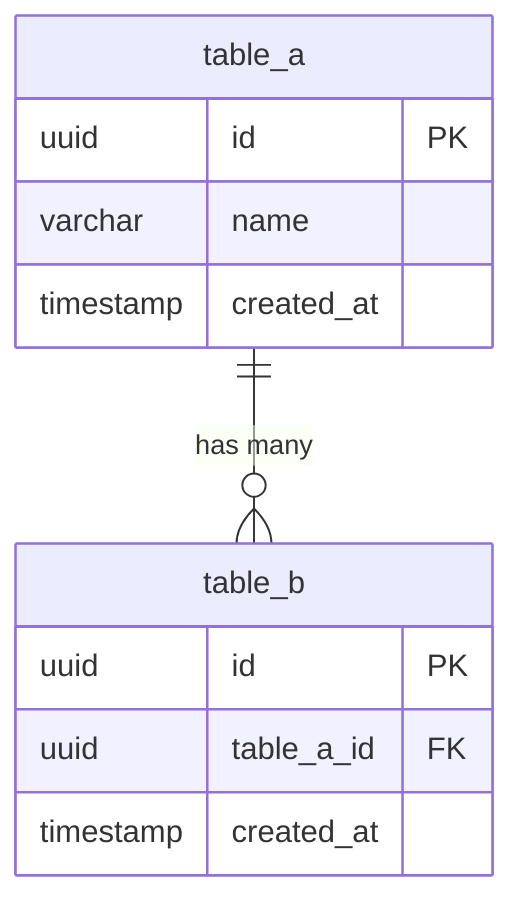

# テーブル定義書（物理設計）

<!-- AI: このテンプレートを使ってテーブル定義書（物理設計）を生成してください。
- docs/requirements/ の要件定義書と docs/design/db-design（基本設計）を参照し、全テーブルを網羅すること
- 型はDB固有の型（varchar(255), bigint, timestamp with time zone 等）を使用し、"string" 等の抽象型は禁止
- インデックス・外部キー・制約は漏れなく定義すること
- 命名規約はプロジェクト全体で統一すること
-->

## 1. 概要

<!-- AI: この物理設計書の対象範囲・目的を2〜3文で記述してください -->

## 2. 命名規約

<!-- AI: プロジェクトで採用する命名規約を記述してください。既存コードやCLAUDE.mdの規約と一致させること -->

| 対象 | 規約 | 例 |
|------|------|-----|
| テーブル名 | スネークケース・複数形 | users, order_items |
| カラム名 | スネークケース | user_id, created_at |
| 主キー | id | id |
| 外部キー | 参照先テーブル単数形_id | user_id, order_id |
| インデックス | idx_{テーブル名}_{カラム名} | idx_users_email |
| ユニーク制約 | uq_{テーブル名}_{カラム名} | uq_users_email |
| チェック制約 | ck_{テーブル名}_{説明} | ck_orders_status |
| トリガー | trg_{テーブル名}_{タイミング}_{説明} | trg_users_before_update |

## 3. テーブル一覧

<!-- AI: 全テーブルを一覧にしてください。見積行数・見積サイズは運用想定から算出すること -->

| # | テーブル名 | 説明 | テーブルスペース | 見積行数 | 見積サイズ |
|---|-----------|------|----------------|---------|-----------|
| 1 | テーブル名 | 説明 | default | - | - |
| 2 | テーブル名 | 説明 | default | - | - |

## 4. テーブル詳細

<!-- AI: テーブルごとにこのセクションを繰り返してください。全テーブル分を漏れなく記載すること -->

### 4.1 テーブル名

| 項目 | 値 |
|------|-----|
| テーブル物理名 | table_name |
| テーブル論理名 | テーブル名 |
| 概要 | テーブルの概要 |
| 関連Spec | REQ-XXX-NNN |

#### カラム定義

<!-- AI: データ型は CLAUDE.md の db 設定に応じて選択すること（postgresql → uuid/timestamptz/jsonb/gen_random_uuid(), mysql → CHAR(36)/DATETIME/JSON/UUID(), sqlite → TEXT/INTEGER/DATETIME 等） -->
<!-- AI: 型はDB固有の型を使用すること。varchar(255), bigint, integer, boolean, timestamp with time zone, uuid, jsonb, text, numeric(10,2) 等 -->

| # | 物理名 | 論理名 | 型 | PK | NULL | デフォルト | 説明 |
|---|--------|--------|------|-----|------|-----------|------|
| 1 | id | ID | uuid | YES | NO | gen_random_uuid() | 主キー |
| 2 | column_name | カラム名 | varchar(255) | - | NO | - | 説明 |
| 3 | created_at | 作成日時 | timestamp with time zone | - | NO | now() | レコード作成日時 |
| 4 | updated_at | 更新日時 | timestamp with time zone | - | NO | now() | レコード更新日時 |

#### インデックス定義

| # | インデックス名 | カラム | ユニーク | 種別 | 条件 |
|---|--------------|--------|---------|------|------|
| 1 | idx_table_column | column_name | NO | BTREE | - |
| 2 | uq_table_column | column_name | YES | BTREE | - |

#### 外部キー

| # | カラム | 参照先 | ON DELETE | ON UPDATE |
|---|--------|--------|-----------|-----------|
| 1 | foreign_id | referenced_table.id | CASCADE | CASCADE |

#### トリガー・制約

<!-- AI: CHECK制約・トリガーがある場合のみ記載。ない場合は「なし」と記載 -->

| # | 名前 | 種別 | 内容 |
|---|------|------|------|
| 1 | trg_table_before_update | TRIGGER | updated_at を自動更新 |
| 2 | ck_table_status | CHECK | status IN ('active', 'inactive') |

#### 削除戦略

<!-- AI: テーブルごとの削除方式を定義してください。論理削除の場合はdeleted_atカラムの追加を確認すること -->

| 項目 | 値 |
|------|-----|
| 削除方式 | 論理削除 / 物理削除 |
| 論理削除カラム | deleted_at (timestamp with time zone, NULL) ※論理削除の場合 |
| カスケード動作 | 親テーブル削除時の子テーブルの扱い（CASCADE / SET NULL / RESTRICT） |
| 削除トリガー | 削除時の副作用（監査ログ記録、関連キャッシュ無効化等） |

<!-- AI: 判断基準:
- 論理削除: ユーザーデータ、取引データ、監査が必要なデータ（復元可能性・追跡性が必要）
- 物理削除: 一時データ、セッション、キャッシュ、ログ（データ量管理が優先）
- 論理削除を採用する場合、カラム定義に deleted_at を追加し、ユニークインデックスに WHERE deleted_at IS NULL の部分インデックスを検討すること
-->

#### パーティション設計

<!-- AI: パーティションが必要な場合のみ記載。不要な場合は「対象外」と記載 -->

| 項目 | 値 |
|------|-----|
| パーティション方式 | RANGE / LIST / HASH |
| パーティションキー | カラム名 |
| パーティション単位 | 月次 / 年次 等 |
| 保持期間 | N ヶ月 |

---

<!-- AI: ここまでのテーブル詳細セクション（4.1）を全テーブル分繰り返してください -->

## 5. ER図

<!-- AI: Mermaid erDiagram で全テーブルの関連を描いてください -->

## 6. マイグレーション戦略

<!-- AI: マイグレーションツール・方針を記述してください。既存データの移行手順も含めること -->

### 6.1 マイグレーションツール

| 項目 | 値 |
|------|-----|
| ツール | - |
| マイグレーションファイル格納先 | - |
| 命名規則 | - |

### 6.2 マイグレーション手順

<!-- AI: 新規構築時とスキーマ変更時の手順をそれぞれ記述してください -->

1. マイグレーション手順1
2. マイグレーション手順2

### 6.3 ロールバック方針

<!-- AI: マイグレーション失敗時のロールバック手順を記述してください -->

## 変更履歴

| バージョン | 日付 | 変更内容 |
|-----------|------|---------|
| 1.0 | YYYY-MM-DD | 初版作成 |
