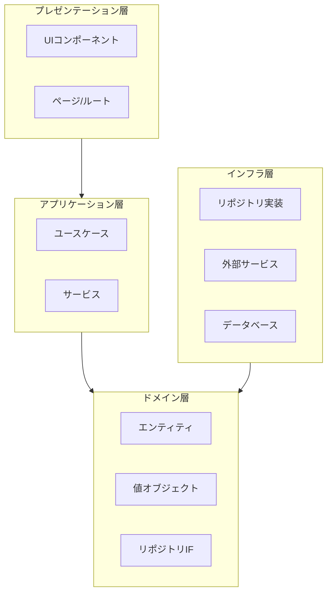
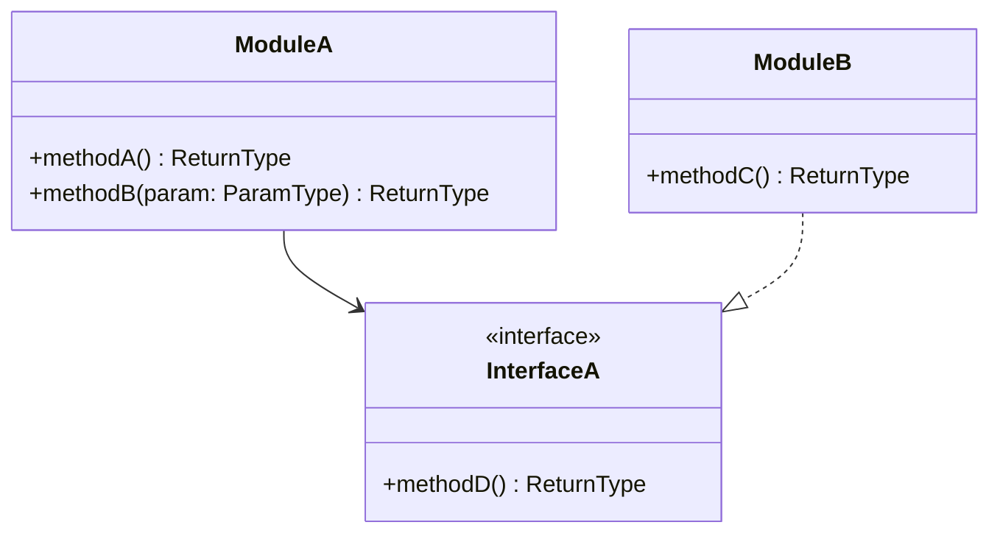
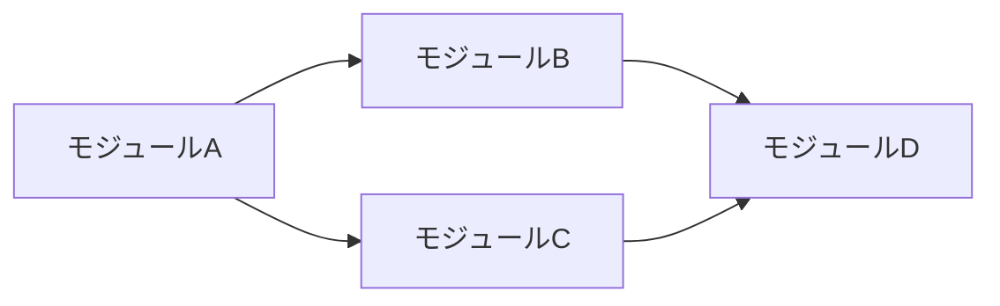

# クラス/モジュール設計書

<!-- AI: このテンプレートを使ってモジュール設計書を生成してください。
- docs/requirements/ の要件定義書と docs/design/ の基本設計を参照すること
- レイヤーアーキテクチャに従い、各モジュールの責務を明確に分離すること
- 依存関係の方向が上位レイヤーから下位レイヤーへの一方向になっていることを検証すること
- 公開インターフェースはパラメータ・戻り値の型を厳密に定義すること
-->

## 1. 概要

<!-- AI: モジュール設計の対象範囲・目的を2〜3文で記述してください -->

## 2. レイヤー構成

<!-- AI: プロジェクトのレイヤー構成を記述してください。CLAUDE.mdの技術スタックと一致させること -->

| レイヤー | 責務 | 配置先ディレクトリ |
|---------|------|------------------|
| プレゼンテーション層 | ユーザーインターフェース、リクエスト/レスポンス処理 | - |
| アプリケーション層 | ユースケースの実行、トランザクション管理 | - |
| ドメイン層 | ビジネスロジック、ドメインルール | - |
| インフラ層 | データアクセス、外部サービス連携 | - |

## 3. モジュール構成図

<!-- AI: Mermaid classDiagram で主要モジュールの関係を描いてください -->

## 4. モジュール一覧

<!-- AI: 全モジュールを一覧にしてください。漏れがないよう要件定義書の全機能をカバーすること -->

| # | モジュール名 | 責務 | レイヤー | 依存先 |
|---|------------|------|---------|--------|
| 1 | モジュール名 | 責務の説明 | アプリケーション | 依存モジュール名 |
| 2 | モジュール名 | 責務の説明 | ドメイン | 依存モジュール名 |

## 5. モジュール詳細

<!-- AI: モジュールごとにこのセクションを繰り返してください。全モジュール分を漏れなく記載すること -->

### 5.1 モジュール名

| 項目 | 値 |
|------|-----|
| モジュール名 | ModuleName |
| ファイルパス | src/path/to/module |
| 責務 | モジュールの責務 |
| レイヤー | アプリケーション層 |
| 関連Spec | REQ-XXX-NNN |

#### 公開インターフェース

<!-- AI: メソッド/関数のシグネチャを厳密に定義してください。型は具体的に記載すること -->

| # | メソッド/関数 | パラメータ | 戻り値型 | 説明 |
|---|-------------|-----------|---------|------|
| 1 | methodName | param1: string, param2: number | Promise\<ReturnType\> | 処理の説明 |
| 2 | methodName | param1: InputType | ReturnType | 処理の説明 |

#### 依存関係

| # | 依存先 | 用途 |
|---|--------|------|
| 1 | 依存モジュール名 | 利用目的 |
| 2 | 依存モジュール名 | 利用目的 |

#### 状態管理

<!-- AI: ステートフルなモジュールの場合のみ記載。ステートレスな場合は「ステートレス」と記載 -->

| 状態 | 型 | 初期値 | 説明 |
|------|------|--------|------|
| state_name | Type | - | 説明 |

#### エラー処理方針

<!-- AI: このモジュールで発生しうるエラーと処理方針を記述してください -->

| エラー種別 | 処理方針 | エラーコード |
|-----------|---------|------------|
| バリデーションエラー | 呼び出し元に例外をスロー | E-XXX-001 |
| 外部サービスエラー | リトライ後にフォールバック | E-XXX-002 |

---

<!-- AI: ここまでのモジュール詳細セクション（5.1）を全モジュール分繰り返してください -->

## 6. フロントエンド状態管理設計

<!-- AI: フロントエンドを含むプロジェクトのみ。バックエンドのみの場合は「該当なし」と記載。
非機能要件定義書の「フロントエンド共通方針」で定義したルールに従い、
機能ごとの具体的な状態を定義する -->

### 6.1 状態一覧

| 状態名 | スコープ | 管理方法 | 永続化 | 初期値 | 更新トリガー |
|--------|---------|---------|--------|--------|------------|
| 例: currentUser | グローバル | Context | sessionStorage | null | ログイン成功時 |
| 例: resourceList | サーバーデータ | SWR | なし（キャッシュ） | [] | ページ表示・作成・削除後 |
| 例: filterParams | URL | URLSearchParams | URL | {} | フィルター操作時 |
| 例: isModalOpen | ローカル | useState | なし | false | ボタンクリック時 |
| 例: formDraft | ローカル | React Hook Form | localStorage（任意） | {} | 入力変更時 |

### 6.2 状態フロー図（該当する場合）

<!-- AI: 複雑な状態遷移がある場合のみ Mermaid で図示する -->

---

## 7. 共通モジュール/ユーティリティ

<!-- AI: 複数モジュールから利用される共通機能を記述してください -->

| # | モジュール名 | 責務 | 配置先 |
|---|------------|------|--------|
| 1 | Logger | ログ出力 | src/lib/logger |
| 2 | Validator | 入力バリデーション | src/lib/validator |
| 3 | ErrorHandler | エラーハンドリング共通処理 | src/lib/error |

## 8. 依存関係図

<!-- AI: モジュール間の依存関係を Mermaid flowchart で描いてください。循環依存がないことを確認すること -->

## 変更履歴

| バージョン | 日付 | 変更内容 |
|-----------|------|---------|
| 1.0 | YYYY-MM-DD | 初版作成 |
