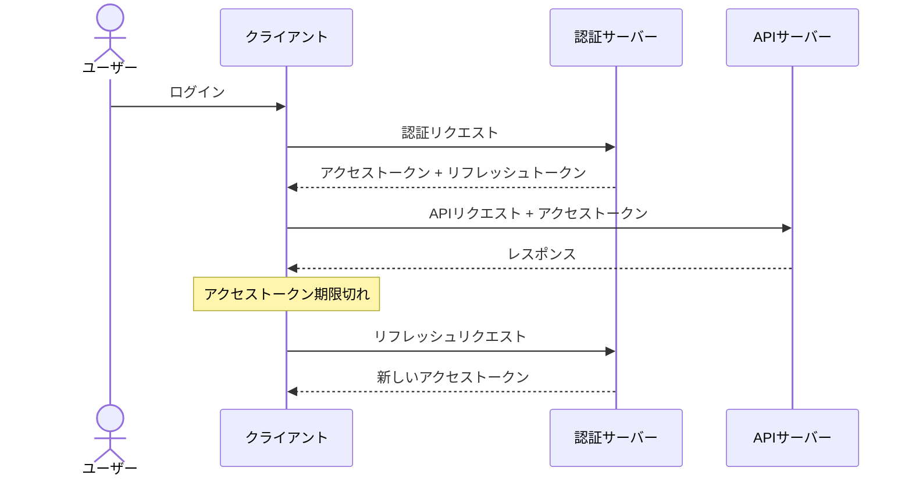

# セキュリティ設計書

<!-- AI: このテンプレートは認証・認可・データ保護に関するセキュリティ設計書です。
- docs/requirements/ の要件定義書（特に REQ-OVERVIEW-001 の非機能要件）を参照すること
- CLAUDE.md に記載の技術スタック・認証方式と一致させること
- 具体的な実装方法と設定値を記載すること（抽象的な方針だけでは不十分）
- 通信セキュリティ・入力検証・監査ログ・OWASP・インシデント対応・コンプライアンスは security-ops.md に記載する
-->

## 1. 概要

<!-- AI: セキュリティ設計書の対象範囲・目的を2〜3文で記述してください。
通信・監査・インシデント対応等は [セキュリティ運用設計書](./security-ops.md) を参照する旨を明記 -->

---

## 2. 認証設計

<!-- AI: プロジェクトの認証方式を具体的に記述してください。CLAUDE.mdの認証ルールと一致させること -->

### 2.1 認証方式

| 項目 | 値 |
|------|-----|
| 認証方式 | JWT / セッション / OAuth 2.0 等 |
| 認証プロバイダ | 自前実装 / Supabase Auth / Auth0 等 |
| MFA対応 | あり / なし / 任意 |

### 2.2 セッション管理

| 項目 | 値 |
|------|-----|
| セッション方式 | Cookie / Token |
| アクセストークン有効期限 | 15分 |
| リフレッシュトークン有効期限 | 7日 |
| セッションストレージ | サーバーサイド / クライアントサイド |
| 同時セッション数 | 制限あり / なし |
| セッション無効化 | ログアウト時 / パスワード変更時 |

### 2.3 トークンライフサイクル

---

## 3. 認可設計

<!-- AI: 権限モデルを具体的に定義してください -->

### 3.1 認可方式

| 項目 | 値 |
|------|-----|
| 認可モデル | RBAC / ABAC / ACL |
| 実装方式 | ミドルウェア / RLS / ポリシーベース |

### 3.2 ロール定義

<!-- AI: ロール名はプロジェクトの権限設計に応じて定義すること。以下は一般的な3ロールモデルの例 -->
<!-- AI: プロジェクトの全ロールを定義してください -->

| # | ロール名 | 説明 | 権限レベル |
|---|---------|------|----------|
| 1 | admin | システム管理者 | 全機能アクセス可 |
| 2 | member | 一般ユーザー | 基本機能のみ |
| 3 | viewer | 閲覧者 | 読み取りのみ |

### 3.3 画面アクセスマトリクス

<!-- AI: 全画面のアクセス制御を定義する。screen-flow.md の画面一覧と一致させること。
ガード処理の実装方式（ミドルウェア / レイアウト / ページ単位）はプロジェクトの技術スタックに合わせる -->

| 画面 | パス | 未認証 | admin | member | viewer | ガード処理 |
|------|------|--------|-------|--------|--------|----------|
| ログイン | /login | ○ | リダイレクト（/dashboard） | リダイレクト（/dashboard） | リダイレクト（/dashboard） | 認証済みならトップへリダイレクト |
| ダッシュボード | /dashboard | → /login | ○ | ○ | ○ | 認証ガード |
| ユーザー管理 | /admin/users | → /login | ○ | → /403 | → /403 | 認証ガード + ロールチェック |
| 設定 | /settings | → /login | ○ | ○ | → /403 | 認証ガード + ロールチェック |

<!-- AI: ガード処理の共通パターン:
- 認証ガード: 未ログイン → ログイン画面にリダイレクト（returnTo パラメータで元画面を保持）
- ロールチェック: 認証済みだが権限不足 → 403 画面を表示
- 認証済みリダイレクト: ログイン画面に認証済みユーザーがアクセス → トップページにリダイレクト
- 実装方式: middleware.ts（Next.js）/ navigation guard（Vue Router）/ レイアウトコンポーネント -->

### 3.4 API権限マトリクス

<!-- AI: 全APIエンドポイントのアクセス制御を定義する。openapi.yaml のエンドポイントと一致させること -->

| リソース | 操作 | admin | member | viewer | 補足条件 |
|---------|------|-------|--------|--------|---------|
| ユーザー | 作成 | YES | NO | NO | - |
| ユーザー | 参照 | YES | YES | YES | member/viewer は自分のみ |
| ユーザー | 更新 | YES | YES | NO | member は自分のみ |
| ユーザー | 削除 | YES | NO | NO | - |

### 3.5 ロール別機能アクセス一覧

<!-- AI: ロール視点で「どの機能が使えるか」を一覧化する。
3.3（画面）と 3.4（API）の情報を機能単位で要約したもの -->

| 機能 | admin | member | viewer | 備考 |
|------|-------|--------|--------|------|
| 例: ダッシュボード閲覧 | ○ | ○ | ○ | - |
| 例: リソース作成・編集 | ○ | ○（自分のみ） | × | - |
| 例: リソース削除 | ○ | ○（自分のみ） | × | - |
| 例: ユーザー管理 | ○ | × | × | 管理者専用 |

---

## 4. データ保護

### 4.1 暗号化

| 対象 | 方式 | アルゴリズム | 鍵管理 |
|------|------|------------|--------|
| 通信中データ | TLS | TLS 1.3 | 証明書管理サービス |
| 保存データ | AES暗号化 | AES-256-GCM | 鍵管理サービス |
| パスワード | ハッシュ化 | bcrypt / argon2 | ソルト自動生成 |

### 4.2 個人情報（PII）取り扱い

<!-- AI: PIIに該当するデータと保護方法を定義してください -->

| データ種別 | PIIレベル | 暗号化 | マスキング | アクセス制限 | 保持期間 |
|-----------|---------|--------|----------|------------|---------|
| メールアドレス | 個人情報 | 保存時暗号化 | ログ出力時 | 認証済みユーザー | 退会後90日 |
| パスワード | 機密情報 | ハッシュ化 | 常時 | アクセス不可 | 退会後即削除 |
| 氏名 | 個人情報 | 保存時暗号化 | ログ出力時 | 認証済みユーザー | 退会後90日 |

### 4.3 データマスキングルール

| マスキング対象 | マスキング方法 | 例 |
|-------------|-------------|-----|
| メールアドレス | ローカル部を部分マスク | t***@example.com |
| 電話番号 | 下4桁以外をマスク | ***-****-1234 |
| 氏名 | 姓をマスク | *** 太郎 |

---

## 変更履歴

| バージョン | 日付 | 変更内容 |
|-----------|------|---------|
| 1.0 | YYYY-MM-DD | 初版作成 |
