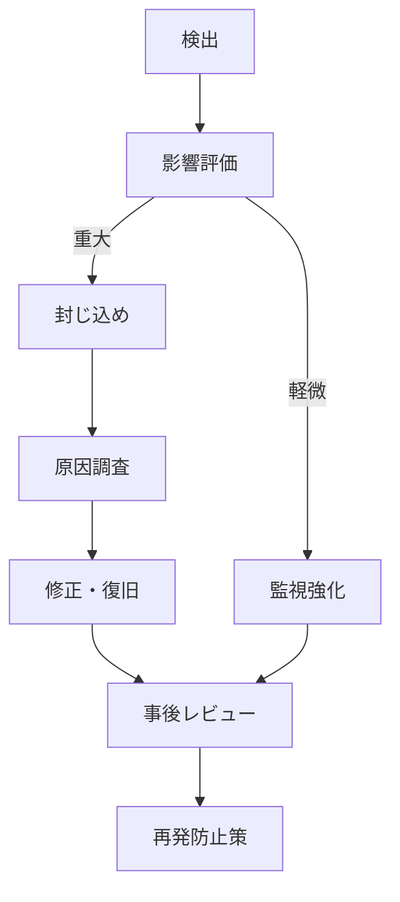

# セキュリティ運用設計書

<!-- AI: このテンプレートはセキュリティの運用・防御・監視に関する設計書です。
- 認証・認可・データ保護は security-design.md を参照すること
- OWASP Top 10 を網羅的にチェックすること
- 具体的な実装方法と設定値を記載すること（抽象的な方針だけでは不十分）
-->

## 1. 概要

<!-- AI: このセキュリティ運用設計書の対象範囲を2〜3文で記述。
認証・認可・データ保護は security-design.md で定義済みであることを明記する -->

認証・認可・データ保護については [セキュリティ設計書](./security-design.md) を参照。
本書では通信セキュリティ、入力検証、監査、インシデント対応、コンプライアンスを定義する。

---

## 2. 通信セキュリティ

### 2.1 TLS設定

| 項目 | 値 |
|------|-----|
| 最小TLSバージョン | TLS 1.2 |
| 推奨TLSバージョン | TLS 1.3 |
| 証明書 | Let's Encrypt / ACM 等 |
| HSTS | 有効（max-age=31536000, includeSubDomains） |

### 2.2 CORS設定

| 項目 | 値 |
|------|-----|
| Access-Control-Allow-Origin | 許可ドメイン一覧 |
| Access-Control-Allow-Methods | GET, POST, PUT, DELETE |
| Access-Control-Allow-Headers | Content-Type, Authorization |
| Access-Control-Allow-Credentials | true |
| Access-Control-Max-Age | 86400 |

### 2.3 CSP（Content Security Policy）

<!-- AI: プロジェクトの要件に合わせてCSPディレクティブを定義してください -->

| ディレクティブ | 値 | 説明 |
|-------------|-----|------|
| default-src | 'self' | デフォルトは自ドメインのみ |
| script-src | 'self' | スクリプトは自ドメインのみ |
| style-src | 'self' 'unsafe-inline' | スタイルは自ドメイン + インライン許可 |
| img-src | 'self' data: | 画像は自ドメイン + data URI |
| connect-src | 'self' https://api.example.com | API接続先 |
| font-src | 'self' | フォントは自ドメインのみ |
| frame-ancestors | 'none' | iframe埋め込み禁止 |

---

## 3. 入力検証

<!-- AI: 各攻撃手法に対する防御策を具体的に記述してください -->

### 3.1 攻撃対策一覧

| 攻撃手法 | 対策 | 実装方法 |
|---------|------|---------|
| XSS（クロスサイトスクリプティング） | 出力エスケープ、CSP | テンプレートエンジン自動エスケープ、CSPヘッダー |
| SQLインジェクション | パラメータバインド | ORM / プリペアドステートメント |
| CSRF（クロスサイトリクエストフォージェリ） | CSRFトークン | フレームワーク組み込み機能 |
| ディレクトリトラバーサル | 入力検証 | パス正規化、ホワイトリスト |
| オープンリダイレクト | リダイレクト先検証 | ホワイトリスト |
| ファイルアップロード攻撃 | ファイル検証 | MIME検証、拡張子制限、サイズ制限 |

### 3.2 サニタイゼーションルール

| 入力種別 | サニタイズ方法 | ライブラリ/関数 |
|---------|-------------|---------------|
| HTML入力 | タグ除去 / エスケープ | DOMPurify 等 |
| SQL入力 | パラメータバインド | ORM 標準機能 |
| ファイル名 | 特殊文字除去 | 正規表現フィルタ |
| URL | プロトコル検証 | URLパーサー |

---

## 4. 監査ログ

### 4.1 ログ対象

<!-- AI: 監査ログとして記録すべきイベントを定義してください -->

| # | イベント | ログレベル | 記録内容 |
|---|---------|----------|---------|
| 1 | ログイン成功 | INFO | ユーザーID、IP、タイムスタンプ |
| 2 | ログイン失敗 | WARN | 試行ユーザー名、IP、タイムスタンプ |
| 3 | ログアウト | INFO | ユーザーID、タイムスタンプ |
| 4 | 権限変更 | WARN | 実行者、対象ユーザー、変更内容 |
| 5 | データ作成・更新・削除 | INFO | 実行者、対象リソース、操作内容 |
| 6 | 管理者操作 | WARN | 実行者、操作内容、対象 |

### 4.2 ログフォーマット

```json
{
  "timestamp": "2024-01-01T00:00:00.000Z",
  "level": "INFO",
  "event": "login_success",
  "user_id": "uuid",
  "ip_address": "xxx.xxx.xxx.xxx",
  "user_agent": "Mozilla/5.0...",
  "request_id": "req_xxxxxxxxxxxx",
  "details": {}
}
```

### 4.3 保持・ローテーション

| ログ種別 | 保持期間 | ローテーション | 保管先 |
|---------|---------|-------------|--------|
| 監査ログ | 1年 | 日次 | ログストレージ |
| アクセスログ | 90日 | 日次 | ログストレージ |
| エラーログ | 180日 | 日次 | ログストレージ |

---

## 5. セキュリティヘッダー

<!-- AI: 設定すべき全セキュリティヘッダーを定義してください -->

| # | ヘッダー | 値 | 目的 |
|---|---------|-----|------|
| 1 | Strict-Transport-Security | max-age=31536000; includeSubDomains | HTTPS強制 |
| 2 | X-Content-Type-Options | nosniff | MIMEスニッフィング防止 |
| 3 | X-Frame-Options | DENY | クリックジャッキング防止 |
| 4 | X-XSS-Protection | 0 | ブラウザXSSフィルター無効化（CSPで代替） |
| 5 | Referrer-Policy | strict-origin-when-cross-origin | リファラー制御 |
| 6 | Permissions-Policy | camera=(), microphone=(), geolocation=() | ブラウザ機能制限 |
| 7 | Content-Security-Policy | セクション2.3参照 | コンテンツ制限 |

---

## 6. 脆弱性対策（OWASP Top 10）

<!-- AI: OWASP Top 10の各項目に対する対策状況をチェックしてください -->

| # | 脆弱性カテゴリ | OWASP ID | 対策 | 実装状況 |
|---|-------------|---------|------|---------|
| 1 | アクセス制御の不備 | A01 | RBAC、RLS、APIミドルウェア | 未実装 / 実装済み |
| 2 | 暗号化の失敗 | A02 | TLS 1.3、AES-256、bcrypt | 未実装 / 実装済み |
| 3 | インジェクション | A03 | パラメータバインド、入力検証 | 未実装 / 実装済み |
| 4 | 安全でない設計 | A04 | 脅威モデリング、設計レビュー | 未実装 / 実装済み |
| 5 | セキュリティ設定のミス | A05 | ヘッダー設定、デフォルト変更 | 未実装 / 実装済み |
| 6 | 脆弱で古いコンポーネント | A06 | 依存関係監査、自動更新 | 未実装 / 実装済み |
| 7 | 識別と認証の失敗 | A07 | MFA、パスワードポリシー、セッション管理 | 未実装 / 実装済み |
| 8 | ソフトウェアとデータの整合性の失敗 | A08 | CI/CDパイプライン検証、署名 | 未実装 / 実装済み |
| 9 | セキュリティログと監視の失敗 | A09 | 監査ログ、アラート、SIEM連携 | 未実装 / 実装済み |
| 10 | SSRF（サーバーサイドリクエストフォージェリ） | A10 | URL検証、ネットワーク分離 | 未実装 / 実装済み |

---

## 7. インシデント対応

### 7.1 検出

<!-- AI: セキュリティインシデントの検出方法を定義してください -->

| 検出方法 | 対象 | 閾値 | 対応 |
|---------|------|------|------|
| ログイン試行監視 | ブルートフォース | 同一IPから5分間に10回失敗 | IPブロック + アラート |
| 異常アクセス検知 | 不正アクセス | 通常パターンからの逸脱 | アラート + 調査 |
| 脆弱性スキャン | 既知の脆弱性 | 定期実行（週次） | パッチ適用 |

### 7.2 対応フロー



### 7.3 復旧手順

| 優先度 | 対応時間目標 | 対応内容 |
|--------|-----------|---------|
| 緊急 | 1時間以内 | サービス停止を伴うインシデント |
| 高 | 4時間以内 | データ漏洩の可能性があるインシデント |
| 中 | 24時間以内 | 限定的な影響のインシデント |
| 低 | 72時間以内 | 潜在的リスク |

---

## 8. コンプライアンス

<!-- AI: プロジェクトに適用される法規制・基準を記述してください -->

| # | 規制・基準 | 適用範囲 | 対応状況 | 備考 |
|---|-----------|---------|---------|------|
| 1 | 個人情報保護法 | 個人情報全般 | 未対応 / 対応済み | - |
| 2 | GDPR | EU圏ユーザーデータ | 該当なし / 対応済み | - |
| 3 | PCI DSS | クレジットカード情報 | 該当なし / 対応済み | - |

---

## 変更履歴

| バージョン | 日付 | 変更内容 |
|-----------|------|---------|
| 1.0 | YYYY-MM-DD | 初版作成 |
